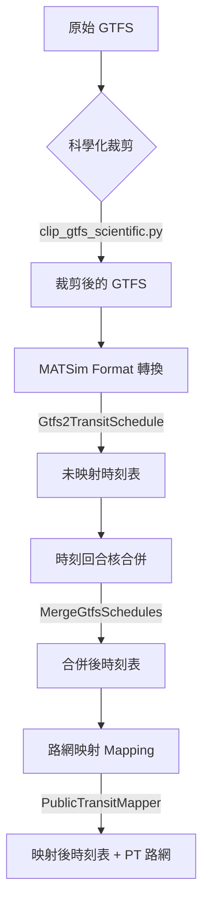

# MATSim 公車整合技術指南 (PT Bus Integration Guide)

本文件說明如何將 GTFS 公車資料整合至 MATSim 撤離模擬路網中，並詳細解析 Phase 2 階段使用的 `ptmapper` 參數設定與背後邏輯。

## 1. 整合流程概覽 (Integration Flow)

公車整合遵循以下管線 (Pipeline)：

### 輸入 (Inputs)
- **GTFS**: 包含 `stops.txt`, `stop_times.txt`, `trips.txt`, `routes.txt`, `calendar.txt`。
- **Road Network**: 清理過的多模式路網 (`network_v7_car_walk_clean.xml.gz`)。
- **Config**: `ptmapper-config-phase2-bus.xml`。

### 輸出 (Outputs)
- **Mapped Schedule**: `transitSchedule-mapped-phase2.xml.gz` (包含站點對應的 linkId)。
- **Network with PT**: `network-with-pt-phase2.xml` (包含公車專用連結或人工連結)。

---

## 2. 公車線路建置原理 (How a Bus Line is Built)

在 MATSim 中，一條公車線路 (TransitLine) 的建製包含四個核心層次：

1.  **Stop Facility (站點)**: 將 GTFS 地理坐標對應到最近的路網連結 (Link)。
2.  **Transit Line (線路)**: 對應 GTFS 的 `route_id`。
3.  **Transit Route (路徑)**: 對應 GTFS 的 `trip_id` 群組，由一系列連結 (Links) 組成路徑。
4.  **Departure (班次)**: 該路徑在特定時間的發車排程。

**映射關鍵**: `ptmapper` 工具不只是找最近的點，它會執行 **路徑搜索 (Routing)**。如果站點 A 對應 Link 1，站點 B 對應 Link 2，它會嘗試在路網中找到從 Link 1 到 Link 2 可行的車輛路徑。

---

## 3. 參數設定詳解 (Parameter Rationale)

針對 Phase 2 公車整合，我們在 `ptmapper-config-phase2-bus.xml` 中進行了特殊調整：

### 核心參數表

| 參數 | 設定值 | 設定原因與邏輯 |
| :--- | :--- | :--- |
| `maxLinkCandidateDistance` | `600.0` (Bus) | **容錯地理位移**: 公車站點坐標常偏離主幹道 (例如在巷弄內或是路邊站牌)。放寬到 600m 確保 95% 以上站點能找到路網連結，避免因找不到連結而捨棄整條線路。 |
| `nLinkThreshold` | `15` | **增加候選數量**: 單一站點附近可能有多條平行路徑或高架橋。提供更多連結候選 (15 個) 讓路徑搜索器 (Router) 有更高機會找到具連續性的路徑。 |
| `strictLinkRule` | `false` | **應對標籤不全**: OSM 資料中有時公車通行的主要道路未標記 `bus` 標籤。設為 `false` 允許公車映射到 `car` 類型的連結，確保路徑不中斷。 |
| `networkRouter` | `AStarLandmarks` | **效能與精度平衡**: 比 SpeedyALT 更穩定，能處理較複雜的搜索組合。 |
| `maxTravelCostFactor` | `30.0` | **處理繞路情況**: 允許路徑搜索時的成本 (距離/時間) 最高可為直線距離的 30 倍。這在市區單行道多、或需要跨越橋樑時非常必要。 |

---

## 4. 為何這樣設定？ (Why these settings?)

### 4.1 災難撤離場景的特殊性
在海嘯撤離模擬中，我們關心的是 **大範圍、高密度的流動**。如果因為參數太嚴苛 (例如 `maxLinkCandidateDistance=100m`) 導致 80% 的公車線路無法映射，模擬結果將嚴重低估公共運輸的疏散能力。

### 4.2 應對 "No Route Found" 錯誤
路徑計算階段最耗時的原因是 Router 找不到連續路徑。透過以下組合優化：
- **放寬 `maxLinkCandidateDistance`**: 讓起點和終點更容易落在大馬路上。
- **關閉 `strictLinkRule`**: 消除因 OSM 標籤遺失導致的阻礙。

---

## 5. 線路建置流程 (Step-by-Step Flow)

1.  **資料預處理**: 執行 `clip_gtfs_scientific.py` 移除位於無關區域及「少於 2 個站點」或「無時間戳記」的無效 Trip。
2.  **轉換**: 將 CSV 格式轉為 XML 格式。
3.  **合併**: 將 Bus 與 Metro 時刻表物理合併，生成 `transitSchedule-phase2.xml`。
4.  **映射 (Mapping)**:
    *   `ptmapper` 讀取配置。
    *   對每個站點搜尋候選 Links。
    *   計算相鄰站點間的最短路徑。
    *   若找不到路徑，則根據 `maxTravelCostFactor` 判定是否建立 **Artificial Link (人工連結)** 以強制連通。
5.  **輸出**: 生成最終包含對應路徑的 `transitSchedule-mapped-phase2.xml.gz`。
