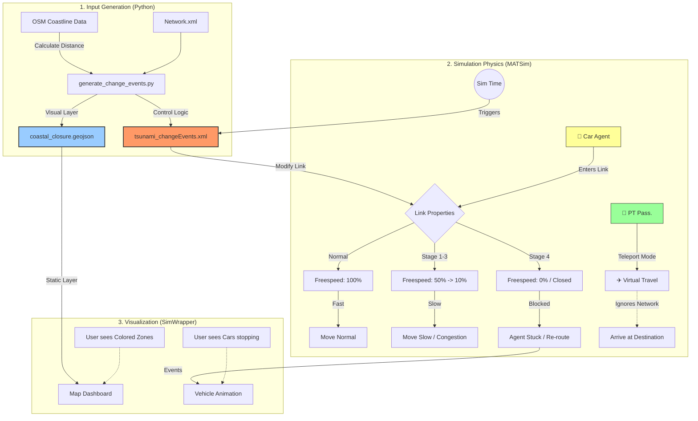

# 系統交互與架構說明：代理人、事件與視覺化

此文件說明 MATSim 模擬中，代理人 (Agent) 如何與動態路網事件 (NetworkChangeEvents) 及視覺化 GeoJSON 進行交互。

## 1. 核心交互流程

整個系統分為三個層次：
1.  **輸入生成層 (Python)**：計算並生成控制檔 (XML) 與視覺化檔 (GeoJSON)。
2.  **物理模擬層 (MATSim QSim)**：實際運行模擬，根據 XML 改變路網物理屬性。
3.  **視覺呈現層 (SimWrapper)**：讀取 GeoJSON 將事件「畫」在地圖上，供人類理解。

### 交互邏輯圖 (Mermaid)

---

## 2. 詳細交互機制

### A. 代理人 (Agents) 與 事件 (Events)
代理人**不會**讀取 GeoJSON。他們只受 `tsunami_changeEvents.xml` 控制。

1.  **時間推進**：模擬時間到達 `03:00` (Stage 1)。
2.  **事件觸發**：MATSim 讀取 XML，找到 Stage 1 對應的 `Link ID`。
3.  **屬性變更**：這些 Links 的 `freespeed` 瞬間變為原來的 50%。
4.  **代理人反應**：
    *   **Car (開車者)**：當他嘗試進入該 Link，引擎計算的行駛時間變長。如果是封閉 (Speed=0)，他會卡住或 (若啟用重規劃) 繞路。
    *   **PT (大眾運輸)**：因為開啟了 `teleportation` 模式，他們**無視**路網變化，直接按時刻表時間「瞬移」到下一站。

### B. GeoJSON 的角色
GeoJSON 純粹是給 **SimWrapper** (人類) 看的「濾鏡」。

*   MATSim 引擎**不知道** GeoJSON 的存在。
*   Python 腳本保證了 `GeoJSON` 的形狀（紅色區域）與 `XML` 中受影響的 Links（降速路段）是**完全對應**的。
*   使用者在儀表板看到「車子開進紅色區域變慢」，是因為：
    1.  紅色區域 (GeoJSON) 顯示在那裡。
    2.  車子 (MATSim) 因為 XML 事件在那裡變慢。
    *這兩者在視覺上同步，但在運算上是獨立的。*

### C. 分階段 (Staging) 邏輯

| 階段 | 距離 (公尺) | 時間 | 物理動作 (XML) | 視覺呈現 (GeoJSON) |
|-----|-----------|------|--------------|------------------|
| **Stage 1** | 0 - 500 | 03:00 | 速度 x 0.5 | 紅色區塊 |
| **Stage 2** | 500 - 1500 | 03:05 | 速度 x 0.5 | 橙色區塊 |
| **Stage 3** | 1500 - 3000 | 03:10 | 速度 x 0.5 | 黃色區塊 |
| **Stage 4** | 3000+ | 03:15 | 速度 x 0.3 | 淺綠區塊 |

---

## 3. 關鍵檔案關聯

*   **生成者**: `tools/generate_change_events.py`
    *   同時產出 `input/tsunami_changeEvents.xml` (物理)
    *   同時產出 `output/coastal_closure.geojson` (視覺)
*   **使用者**:
    *   MATSim Run -> 讀取 `xml`
    *   SimWrapper -> 讀取 `geojson`
