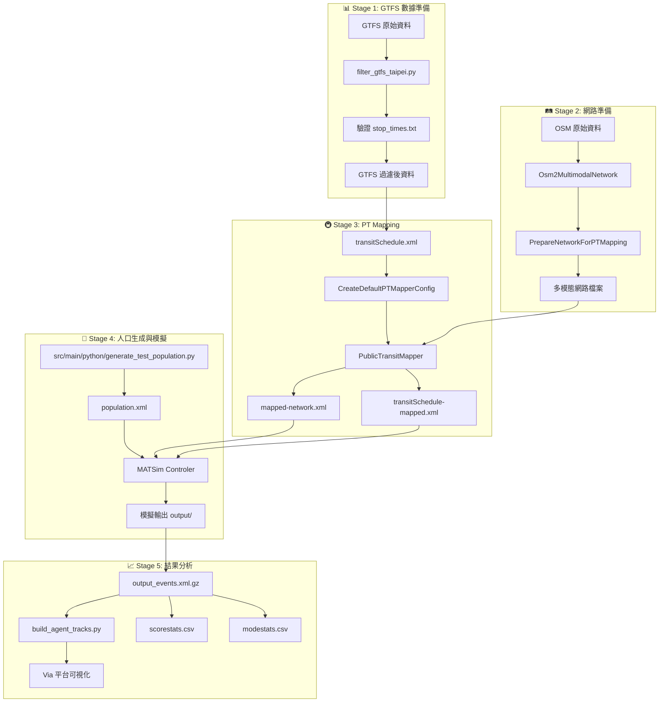

# MATSim 數據 Pipeline 完整指南

**最後更新**：2025-12-08  
**版本**：1.0  
**適用對象**：MATSim 初學者、AI Agent 協作者

---

## 🎯 專案總覽

### 什麼是 MATSim？

**MATSim**（Multi-Agent Transport Simulation）是一個開源的大規模交通模擬框架，用於模擬城市交通系統中數百萬個代理人（agents）的日常出行行為。

**本專案核心功能**：
- 🚇 **公共交通模擬**：完整的 GTFS 到 MATSim 轉換流程
- 🚗 **多模態網路**：支援捷運、公車、汽車、步行
- 📊 **結果分析**：Via 平台可視化導出

### Pipeline 流程圖



### 快速參考表

| 階段 | 主要工具 | 輸入 | 輸出 | 預估時間 |
|------|----------|------|------|----------|
| Stage 1 | Python 腳本 | GTFS zip | 過濾後 GTFS | 10-20 分鐘 |
| Stage 2 | pt2matsim JAR | OSM 檔案 | network.xml | 20-30 分鐘 |
| Stage 3 | PublicTransitMapper | GTFS + Network | mapped files | 1-3 小時 |
| Stage 4 | Python + MATSim | population.xml | output/ | 5-60 分鐘 |
| Stage 5 | Python 腳本 | events.xml.gz | Via 檔案 | 5-10 分鐘 |

---

## 📦 環境準備與安裝

### 系統需求

| 項目 | 最低需求 | 建議配置 |
|------|----------|----------|
| **JDK** | Java 21 | Java 21 (必須) |
| **Maven** | 3.6+ | 3.8+ |
| **Python** | 3.8+ | 3.10+ |
| **記憶體** | 8GB RAM | 16GB+ RAM |
| **磁碟空間** | 20GB | 50GB+ |
| **作業系統** | macOS/Linux/Windows | macOS/Linux |

### 安裝步驟

#### 1. 安裝 Java 21

```bash
# macOS (使用 Homebrew)
brew install openjdk@21
export JAVA_HOME=/opt/homebrew/opt/openjdk@21

# 驗證安裝
java -version  # 應顯示 21.x.x
```

#### 2. 安裝 Maven

```bash
# macOS
brew install maven

# 驗證
mvn -version
```

#### 3. 安裝 Python 依賴

```bash
# 安裝 pandas
pip install pandas

# 可選：安裝其他分析工具
pip install matplotlib numpy
```

#### 4. 建置專案

```bash
cd /path/to/matsim-example-project

# 使用 Maven Wrapper 建置（推薦）
./mvnw clean package

# 預期輸出：BUILD SUCCESS
```

### 驗證安裝

```bash
# 檢查所有工具是否就緒
java -version                    # Java 21
mvn -version                     # Maven 3.6+
python3 --version                # Python 3.8+
ls matsim-example-project-0.0.1-SNAPSHOT.jar  # JAR 檔案存在
```

---

## 🤖 Agent 協作指南

> [!IMPORTANT]
> 這一節專門說明如何讓 AI Agent（如 Claude、Gemini）有效協作此專案

### 專案記憶檔案

本專案有兩個重要的 Agent 記憶檔案：

| 檔案 | 用途 | 內容 |
|------|------|------|
| `CLAUDE.md` | Claude 專用指引 | 完整架構、命令、常見問題（810 行）|
| `docs/notes/GEMINI.md` | Gemini 專用指引 | 專案概覽、建置說明（較簡潔）|

### 協作規範

#### ✅ 應該做的事

1. **先閱讀記憶檔案**
   ```
   在開始任何任務前，先讀取 CLAUDE.md 或 docs/notes/GEMINI.md
   ```

2. **使用現代化工具**
   ```bash
   # ✅ 正確：使用 ripgrep 搜尋
   rg 'swissRailRaptor' scenarios/
   
   # ✅ 正確：使用 fd 找檔案
   fd -e java 'Test\.java' src/test/
   
   # ❌ 錯誤：使用 grep/find
   grep 'swissRailRaptor' scenarios/  # 不建議
   ```

3. **避免讀取大型檔案**
   ```bash
   # ⚠️ 高風險目錄（檔案可能數百 MB）
   - scenarios/*/          # 網路、人口 XML
   - output/                # 模擬輸出
   - pt2matsim/data/        # GTFS、OSM 資料
   
   # ✅ 安全做法
   ls -lh file.xml.gz                    # 先檢查大小
   zcat file.xml.gz | head -50           # 只看前 50 行
   rg 'pattern' file.xml.gz              # 用搜尋而非全讀
   ```

4. **分階段執行長時間任務**
   ```bash
   # PT Mapping 可能耗時 2-3 小時
   # 建議使用 timeout 避免無限等待
   timeout 3h java -Xmx12g -cp pt2matsim/work/pt2matsim-25.8-shaded.jar \
     org.matsim.pt2matsim.run.PublicTransitMapper config.xml
   ```

#### ❌ 不應該做的事

1. **不要一次讀取整個大型 XML 檔案**
2. **不要跳過驗證步驟直接執行下一階段**
3. **不要忽略記憶檔案中的配置要求**
4. **不要使用過時的 Unix 命令（grep, find）**

### 常用指令速查

```bash
# 建置專案
./mvnw clean package

# 執行模擬
java -Xmx8g -jar matsim-example-project-0.0.1-SNAPSHOT.jar config.xml

# 檢查事件檔案
gunzip -c output/output_events.xml.gz | rg 'PersonEntersVehicle' | head -20

# 驗證 GTFS
python3 -c "import pandas as pd; print(len(pd.read_csv('stop_times.txt')))"

# 監控記憶體
watch -n 5 'free -h'
```

---

## 📊 Stage 1: GTFS 數據準備

### 目標

將原始 GTFS（General Transit Feed Specification）資料過濾並驗證，確保符合 MATSim 要求。

### GTFS 檔案結構

```
gtfs_taipei/
├── agency.txt          # 營運機構
├── routes.txt          # 路線定義
├── trips.txt           # 班次定義
├── stops.txt           # 站點位置
├── stop_times.txt      # ⭐ 停靠時間（最重要）
├── calendar.txt        # 服務日期
└── shapes.txt          # 路線幾何（可選）
```

> [!IMPORTANT]
> **stop_times.txt 是最關鍵的檔案！**  
> 它定義了每條路線在各站的停靠時間和順序。缺少此檔案會導致 PT Mapping 失敗。

### 操作步驟

#### Step 1.1: 放置 GTFS 資料

```bash
# 將 GTFS zip 檔案放入
mkdir -p pt2matsim/data/
cp taipei_metro.zip pt2matsim/data/
```

#### Step 1.2: 過濾 GTFS（可選）

如果需要只保留特定區域或路線：

```bash
cd pt2matsim/tools/
python3 filter_gtfs_taipei.py
```

#### Step 1.3: 驗證 GTFS

```python
# 驗證腳本
import pandas as pd
from pathlib import Path

gtfs_dir = Path('pt2matsim/data/gtfs_taipei')
routes = pd.read_csv(gtfs_dir / 'routes.txt', dtype=str)
trips = pd.read_csv(gtfs_dir / 'trips.txt', dtype=str)
stop_times = pd.read_csv(gtfs_dir / 'stop_times.txt', dtype=str)

print(f"Routes: {len(routes)}")
print(f"Trips: {len(trips)}")
print(f"Stop_times: {len(stop_times)}")

# 計算匹配度
matching = len(set(trips['trip_id']) & set(stop_times['trip_id'])) / len(trips) * 100
print(f"Stop_times 匹配度: {matching:.1f}%")

if matching > 90:
    print("✅ GTFS 已準備好！")
else:
    print("❌ GTFS 需要修復")
```

### 驗證檢查清單

- [ ] `stop_times.txt` 存在
- [ ] `stop_times.txt` 匹配度 > 90%
- [ ] `stops.txt` 包含座標（stop_lat, stop_lon）
- [ ] `routes.txt` 包含必要欄位（route_id, route_type）

### 常見問題與解決

| 問題 | 原因 | 解決方案 |
|------|------|----------|
| stop_times.txt 缺失 | GTFS 來源不完整 | 使用 `rebuild_gtfs_with_stop_times.py` 重建 |
| 匹配度低於 50% | trip_id 格式不一致 | 使用 `fix_stop_times_issue.py` 修復 |
| 座標系統錯誤 | 使用 WGS84 而非 EPSG:3826 | 使用 `ConvertGtfsCoordinates.java` 轉換 |

---

## 🛤️ Stage 2: 網路準備

### 目標

從 OSM（OpenStreetMap）資料建立多模態交通網路，包含道路、軌道和人行道。

### 操作步驟

#### Step 2.1: 取得 OSM 資料

```bash
# 從 BBBike 或 Geofabrik 下載 OSM 資料
# 放置到 pt2matsim/data/osm/
```

#### Step 2.2: 轉換 OSM 為多模態網路

```bash
# 使用 pt2matsim 建立多模態網路
java -cp pt2matsim/work/pt2matsim-25.8-shaded.jar \
  org.matsim.pt2matsim.run.Osm2MultimodalNetwork \
  input.osm output_network.xml config.xml
```

#### Step 2.3: 清理網路（可選）

```bash
# 使用自訂 Java 工具清理網路
java -cp target/classes \
  org.matsim.project.tools.PrepareNetworkForPTMapping \
  network.xml cleaned_network.xml
```

### 網路模式說明

```xml
<!-- 網路連結的 allowed modes -->
<link id="12345" ... allowedModes="car,bus">  <!-- 道路 -->
<link id="pt_BL01_UP" ... allowedModes="pt,subway">  <!-- 捷運 -->
<link id="walk_123" ... allowedModes="walk">  <!-- 人行道 -->
```

### 驗證檢查清單

- [ ] 網路檔案大小合理（通常 50-200 MB）
- [ ] 包含多種 modes（car, pt, walk）
- [ ] 連結數量符合預期（數萬到數十萬）

### 常見問題與解決

| 問題 | 原因 | 解決方案 |
|------|------|----------|
| "Network is not connected" | 網路有斷開的區塊 | 執行 `PrepareNetworkForPTMapping` 清理 |
| 缺少 car mode | OSM 過濾太嚴格 | 調整 Osm2MultimodalNetwork 配置 |
| 連結長度為 0 | 座標轉換問題 | 確認座標系統為 EPSG:3826 |

---

## 🚇 Stage 3: PT Mapping（公共交通映射）

### 目標

將 GTFS 轉換的時刻表映射到交通網路上，建立虛擬 PT 網路。

> [!WARNING]
> **這是最耗時的階段！**  
> 預計需要 1-3 小時，請確保有足夠的記憶體（12GB+）

### 操作步驟

#### Step 3.1: 轉換 GTFS 為 MATSim 格式

```bash
# 使用 Java 工具轉換
java -cp target/classes \
  org.matsim.project.tools.GtfsToMatsim \
  pt2matsim/data/taipei_metro.zip \
  output/transitSchedule.xml \
  output/transitVehicles.xml
```

#### Step 3.2: 建立 PT Mapper 配置

```bash
java -cp pt2matsim/work/pt2matsim-25.8-shaded.jar \
  org.matsim.pt2matsim.run.CreateDefaultPTMapperConfig \
  ptmapper-config.xml
```

#### Step 3.3: 編輯配置檔案

```xml
<!-- ptmapper-config.xml 關鍵參數 -->
<module name="ptmapper">
    <!-- 站點到候選連結的最大距離（公尺）-->
    <param name="maxLinkCandidateDistance" value="300.0"/>
    
    <!-- 每個站點的候選連結數量 -->
    <param name="nLinkThreshold" value="12"/>
    
    <!-- 建立人工連結前的成本倍數 -->
    <param name="maxTravelCostFactor" value="15.0"/>
    
    <!-- 路由演算法 -->
    <param name="networkRouter" value="AStarLandmarks"/>
    
    <!-- 執行緒數量 -->
    <param name="numOfThreads" value="4"/>
</module>
```

#### Step 3.4: 執行 PT Mapping

```bash
# 使用 timeout 避免無限執行
timeout 3h java -Xmx12g -cp pt2matsim/work/pt2matsim-25.8-shaded.jar \
  org.matsim.pt2matsim.run.PublicTransitMapper \
  ptmapper-config.xml 2>&1 | tee ptmapper.log

# 在另一個終端機監控
watch -n 5 'free -h'
tail -f ptmapper.log
```

### 輸出檔案

```
pt2matsim/output/
├── transitSchedule-mapped.xml.gz   # 映射後時刻表
├── transitVehicles.xml             # 車輛定義
├── network-mapped.xml.gz           # 更新後網路
└── mapping-statistics.csv          # 映射統計
```

### 驗證檢查清單

- [ ] `transitSchedule-mapped.xml.gz` 已生成
- [ ] 路線數量 > 2,000
- [ ] 停靠點數量 > 40,000
- [ ] 日誌中無嚴重錯誤

```bash
# 驗證命令
gunzip -c transitSchedule-mapped.xml.gz | grep -c '<transitRoute'
# 應輸出 > 2000

gunzip -c transitSchedule-mapped.xml.gz | grep -c '<stop refId='
# 應輸出 > 40000
```

### 常見問題與解決

| 問題 | 原因 | 解決方案 |
|------|------|----------|
| 記憶體不足 (OOM) | -Xmx 設定太低 | 增加到 `-Xmx12g` 或更高 |
| 大量人工連結警告 | 站點離網路太遠 | 增加 `maxLinkCandidateDistance` 到 500m |
| 映射超時 | 網路太大或配置不當 | 減少網路範圍或使用 `SpeedyALT` 路由器 |
| 路線映射失敗 | 網路不連通 | 先執行 Stage 2 的網路清理 |

---

## 👥 Stage 4: 人口生成與模擬執行

### 目標

生成代理人人口並執行 MATSim 模擬。

### 人口檔案結構

```xml
<?xml version="1.0" encoding="UTF-8"?>
<population>
  <person id="pt_agent_01">
    <plan selected="yes">
      <!-- 早上：從家出發 -->
      <activity type="home" x="296356.46" y="2766793.71" end_time="07:30:00"/>
      <leg mode="walk"/>
      <activity type="pt interaction" x="296356.46" y="2766793.71" max_dur="00:05:00"/>
      <leg mode="pt"/>
      <activity type="pt interaction" x="302503.61" y="2771706.94" max_dur="00:05:00"/>
      <leg mode="walk"/>
      <!-- 工作 8 小時 -->
      <activity type="work" x="302503.61" y="2771706.94" end_time="16:00:00"/>
      <!-- 晚上：回家 -->
      <leg mode="walk"/>
      <activity type="pt interaction" .../>
      <leg mode="pt"/>
      <activity type="pt interaction" .../>
      <leg mode="walk"/>
      <activity type="home" x="296356.46" y="2766793.71"/>
    </plan>
  </person>
</population>
```

### 操作步驟

#### Step 4.1: 生成測試人口

```bash
# 使用 Python 腳本生成 50 個代理人
python3 src/main/python/generate_test_population.py

# 輸出：scenarios/corridor/taipei_test/test_population_50.xml
```

#### Step 4.2: 設定 config.xml

```xml
<!-- 關鍵配置 -->
<module name="transit">
    <param name="useTransit" value="true"/>
    <param name="transitModes" value="pt"/>
    <param name="routingAlgorithmType" value="SwissRailRaptor"/>
</module>

<module name="routing">
    <!-- PT 不放在 networkModes！ -->
    <param name="networkModes" value="car"/>
    <!-- PT 不放在 teleportedModeParameters！ -->
</module>

<module name="swissRailRaptor">
    <param name="useIntermodalAccessEgress" value="false"/>
    <param name="transferPenaltyBaseCost" value="0.0"/>
</module>

<module name="controller">
    <param name="lastIteration" value="10"/>
    <param name="outputDirectory" value="./output"/>
</module>
```

#### Step 4.3: 執行模擬

```bash
# 進入場景目錄
cd scenarios/corridor/taipei_test/

# GUI 模式
java -Xmx8g -jar ../../../matsim-example-project-0.0.1-SNAPSHOT.jar config.xml

# 無頭模式（較快）
java -Xmx8g -jar ../../../matsim-example-project-0.0.1-SNAPSHOT.jar config.xml \
  --config:controller.snapshotFormat null \
  --config:controller.lastIteration 5
```

### 驗證檢查清單

- [ ] 模擬完成無嚴重錯誤
- [ ] `output/scorestats.csv` 顯示分數提升
- [ ] PT 代理人有多個 `PersonEntersVehicle` 事件

```bash
# 驗證 PT 代理人搭乘行為
gunzip -c output/output_events.xml.gz | \
  grep 'PersonEntersVehicle' | \
  grep 'pt_agent' | head -20
```

### 常見問題與解決

| 問題 | 原因 | 解決方案 |
|------|------|----------|
| PT 代理人直接傳送 | PT 在 teleportedModeParameters | 移除 PT 的傳送配置 |
| ClassCastException | PT 路由配置錯誤 | 確認 `useIntermodalAccessEgress=false` |
| 代理人不搭車 | transitSchedule 未載入 | 確認 `useTransit=true` |
| 模擬極慢 | 迭代次數太多 | 測試時設定 `lastIteration=5` |

---

## 📈 Stage 5: 結果分析與可視化

### 目標

分析模擬結果並導出到 Via 平台進行可視化。

### 輸出檔案說明

```
output/
├── ITERS/
│   ├── it.0/           # 初始迭代
│   ├── it.5/           # 最後迭代
│   │   ├── 5.events.xml.gz    # 事件紀錄
│   │   └── 5.plans.xml.gz     # 代理人計畫
├── output_events.xml.gz       # 最終事件
├── output_plans.xml.gz        # 最終計畫
├── output_network.xml.gz      # 網路
├── scorestats.csv             # 分數統計 ⭐
├── modestats.csv              # 模式統計 ⭐
└── logfile.log                # 日誌
```

### 操作步驟

#### Step 5.1: 檢查模擬結果

```bash
# 檢查分數演化
cat output/scorestats.csv

# 預期：avg_executed 逐漸增加
# Iteration | avg_executed | avg_worst | avg_best
# 0         | 22.2         | 22.2      | 22.2
# 5         | 75.0         | 1.0       | 85.0
```

#### Step 5.2: 導出 Via 可視化

```bash
python3 src/main/python/build_agent_tracks.py \
  --plans output/output_plans.xml.gz \
  --events output/output_events.xml.gz \
  --schedule output/output_transitSchedule.xml.gz \
  --vehicles output/output_transitVehicles.xml.gz \
  --network output/output_network.xml.gz \
  --export-filtered-events \
  --out forVia \
  --dt 5
```

#### Step 5.3: Via 導出檔案

```
forVia/
├── output_events.xml          # 過濾後事件（Via 匯入用）
├── output_network.xml.gz      # 網路拓撲
├── tracks_dt5s.csv            # 代理人軌跡（5秒間隔）
├── filtered_vehicles.csv      # 使用車輛
└── vehicle_usage_report.txt   # 統計報告
```

### 視覺化工具

```bash
# 使用 Python 腳本產生互動式網頁
python3 src/main/python/visualization/visualize_metro_filtered.py \
  --output-dir 100000_output_v3_clean \
  --output-html metro_viz_filtered.html

# 輸出：metro_viz_filtered.html
# 在瀏覽器中開啟即可查看動畫
```

### 驗證檢查清單

- [ ] `scorestats.csv` 顯示分數收斂
- [ ] Via 檔案成功生成
- [ ] 視覺化動畫正常播放

---

## ❓ 附錄

### 問題速查表

| 問題關鍵字 | 可能原因 | 解決方案連結 |
|------------|----------|--------------|
| `stop_times.txt missing` | GTFS 不完整 | [Stage 1](#常見問題與解決) |
| `Network not connected` | 網路斷開 | [Stage 2](#常見問題與解決-1) |
| `OutOfMemoryError` | 記憶體不足 | [Stage 3](#常見問題與解決-2) |
| `ClassCastException` | PT 配置錯誤 | [Stage 4](#常見問題與解決-3) |
| `PT teleporting` | PT 在傳送模式 | [Stage 4](#常見問題與解決-3) |
| `Agents not boarding` | SwissRailRaptor 設定 | [Stage 4](#常見問題與解決-3) |

### 命令速查表

```bash
# === 建置與執行 ===
./mvnw clean package                    # 建置專案
java -jar matsim-*.jar config.xml       # 執行模擬

# === GTFS 驗證 ===
python3 -c "import pandas as pd; print(len(pd.read_csv('stop_times.txt')))"

# === 事件分析 ===
gunzip -c output/output_events.xml.gz | rg 'PersonEntersVehicle' | head -20
gunzip -c output/output_events.xml.gz | rg 'VehicleArrivesAtFacility' | head -20

# === 網路分析 ===
rg -c 'allowedModes=\"car' network.xml   # 計算道路連結數

# === 監控 ===
watch -n 5 'free -h'                     # 監控記憶體
tail -f logfile.log                      # 追蹤日誌
```

### 座標系統

本專案預設使用 **EPSG:3826**（TWD97 / TM2 zone 121，台灣）。

```xml
<module name="global">
    <param name="coordinateSystem" value="EPSG:3826"/>
</module>
```

### 參考文檔連結

| 文檔 | 用途 |
|------|------|
| [1-quick-start.md](1-quick-start.md) | 快速開始 |
| [3-public-transit.md](3-public-transit.md) | PT 完整指南 |
| [simulation-guide.md](simulation-guide.md) | 模擬執行指南 |
| [6-troubleshooting.md](6-troubleshooting.md) | 疑難排解 |
| [CLAUDE.md](../CLAUDE.md) | Agent 完整指引 |

---

**文檔維護者**：AI Agent  
**最後更新**：2025-12-08
