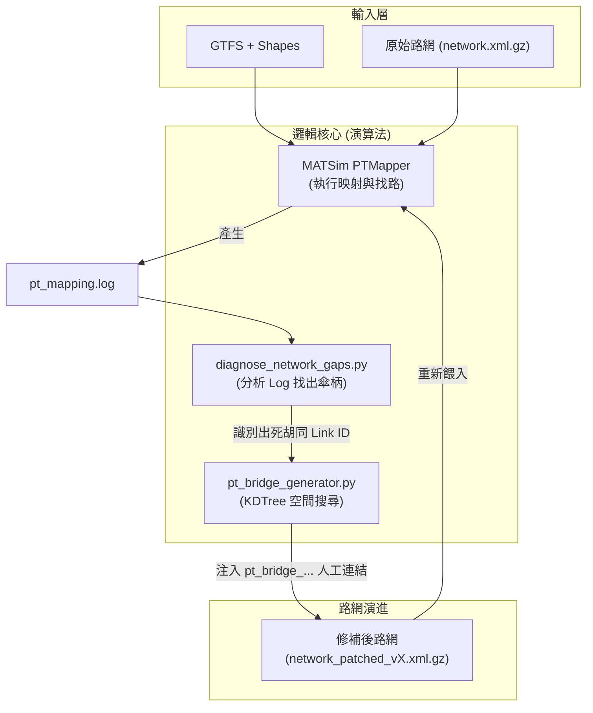
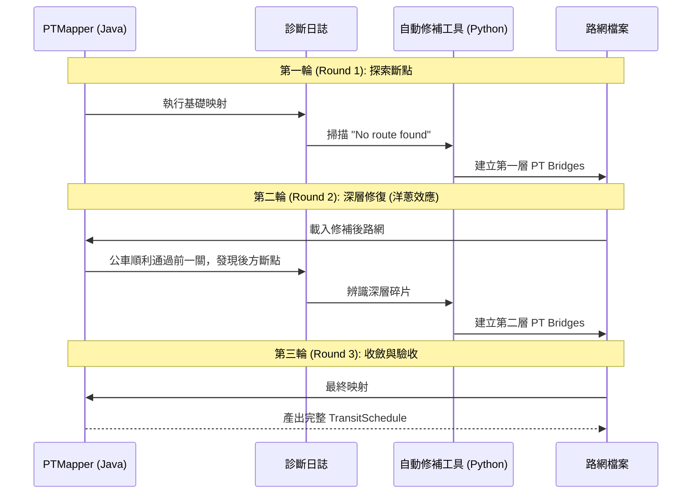

# PT Mapping 技術分析報告：Shape 映射的挑戰與瓶頸

本報告旨在說明今日 PT Mapping Pipeline 的重建工作，並深入探討「含 Shape」與「不含 Shape」映射之間的差異，以及為何「正確的路網」難以迅速產出。

## 1. 今日工作摘要
- **Pipeline 重建**：統一座標系統為 EPSG:3826 (TWD97)，解決之前發生的偏移問題。
- **路網優化**：應用 SCC (Strongly Connected Component) 演算法篩選路網，確保其連通性，減少找路失敗。
- **Shape 映射驗證**：開發診斷腳本 (`diagnose_network_gaps.py`) 分析找路失敗的斷點。
- **生產環境打包**：篩選 450 條關鍵路線（含全捷運及淡水公車），打包成可直接在伺服器執行的 Package。

## 2. 「無 Shape」vs 「含 Shape」映射

### 無 Shape 映射：看似完美，實則虛假
- **運作模式**：Mapper 僅嘗試連接「停靠站 A」與「停靠站 B」。
- **優點**：找路成功率極高，因為它只需要在兩點間找到一條路。
- **缺點（過多人工鏈結）**：
    - 如果兩站間的道路不連通，Mapper 會直接建立一個很長的人工「橋樑」(Artificial Link) 來跳過斷點。
    - 它完全忽略了公車實際行駛的轉彎與繞路邏輯，導致公車在模擬中會像「幽靈」一樣穿過沒有道路的地帶。
    - **結果**：路網看起來很乾淨（人工連結少），但行為完全錯誤。

### 含 Shape 映射：追求真實，反曝缺陷
- **運作模式**：Mapper 強制要求路線必須貼合 GTFS 提供的高精度軌跡 (Shape Points)。
- **難點與瓶頸**：
    - **嚴苛的連通性要求**：如果 Shape 軌跡因為座標誤差偏向了逆向車道，或是偏離路網 5 公尺，Mapper 就會因為「找不到符合軌跡的合法路徑」而被迫在每個 Shape Point 間插入微小的人工連結。
    - **運算爆炸**：原本兩站之間只需找一次路，現在必須在數十個 Shape Point 間反覆找路，導致運算時間增加數十倍。
    - **網絡碎片化**：今日發現 MRT 路線產生近 8000 個找路警告，主因是目前的 `car,bus` 路網完全沒有鐵軌資訊，導致 Mapper 在空無一物的空間中徒勞掙扎。

## 3. 為何無法迅速產出「正確的路網」？

要達成「零人工連結」且「符合 Shape」的路網，是一個典型的「雞生蛋、蛋生雞」問題：

1.  **路網品質限制**：現有的路網（由單線 Shapefile 轉成）在轉彎處、單行道限制或上下層高架橋的連結上不一定完美，而 PTMapper 的找路邏輯極其嚴格。
2.  **GTFS 精度落差**：GTFS 的 Shape Points 往往基於 GPS 採樣，與 MATSim 的抽象連結 (Link) 在幾何上位元並不完全重疊。
3.  **模式失配 (Mode Mismatch)**：如報告所述，捷運嘗試映射到道路網會導致大量報錯。必須手動將這些路線隔離或定義替代模式。

### 結論與對策：科學化與優化流程 (Advanced Workflow)

為了克服上述瓶頸，我開發了兩套「科學化工具」來提升映射品質與穩定性：

1.  **軌跡抽樣優化 (Shape Sampling Optimization)**：
    - **工具**：`optimize_gtfs_shapes.py`
    - **原理**：將原本過於密集的 Shape Points 重採樣（例如每 50m 一點）。
    - **效果**：減少 PTMapper 找路時的過度約束，大幅提升成功率。

2.  **空間斷點可視化 (Gap GeoJSON Visualizer)**：
    - **工具**：`visualize_network_gaps.py`
    - **原理**：將 Log 中的錯誤轉換為 GeoJSON，在地圖上呈現 **「傘狀圖案」(Umbrella Pattern)**。

---

## 4. 特殊現象分析：傘狀圖案 (Umbrella Pattern)

在地圖上看到從一個點放射出多條線段（扇出），代表 **「扇出效應」(Fan-out Effect)**：
- **形成原因**：公車在某個路段（傘柄）被「卡住」了。雖然它找到了下一個停靠站的複數個候選路段（傘面），但因為傘柄路段是**死胡同**、**單行道逆向**或**缺乏轉向連結**，導致找路邏輯全面崩潰。
- **診斷價值**：傘柄的位置即是路網拓撲的「癌症點」，修復一個傘柄通常就能解決整條路線的映射問題。

---

## 5. 未來策略評估：主幹道優先映射方案 (Main-Road Priority Strategy)

**用戶提案內容**：
1. 定位「傘柄」位置（斷點）。
2. 篩選站點附近的「主幹道」(Major Roads)。
3. 強制讓公車站點與主幹道建立人工連結，讓公車繞過碎裂的小巷，優先進入主幹道路網。

**技術可行性分析**：
- **方案高度可行**：這是一種「路網解耦」策略。透過腳本自動在站點與最近的 `ROADCLASS` 高階路段間建立虛擬 Link，可以極大化公車與私家車路網的共享率。
- **優點**：即使巷弄路網不完整，公車也能順利執行導航。
- **建議實施步驟**：
    - 在 PT Mapping 前，利用 `NetworkUtils` 偵測站點周邊 100m 內的最強連通組件 (SCC) 之主幹道。
    - 若 PTMapper 報錯，則自動切換為此人工連結模式。

---

## 6. 核心探究：為什麼 PT Mapping 比私家車路經搜尋更容易失敗？

雖然 `pt2matsim` 與 MATSim 私家車路徑搜尋都使用相同的底層算法（如 `SpeedyALT`），但它們在**數據約束**與**搜尋維度**上有本質區別：

| 特性 | 私家車路徑搜尋 (OD Routing) | PT Mapping (Constraint Routing) |
| :--- | :--- | :--- |
| **目標數** | 單一起點 -> 單一終點 (1 to 1) | 起點 -> 停靠站1 -> ... -> 終點 (1 to N) |
| **約束強度** | 極低 (只要路網連通即可) | **極高** (必須精確經過選定的 Link Candidate) |
| **路網模式限制** | 通常包含全模式 (car, bike, etc.) | 嚴格限制為 `bus` 或 `rail` |
| **容錯機制** | 失敗時會報錯但通常路網全連通 | 只要中間任兩個 Shape Point 間斷裂，整條路徑即宣告失敗 |

### 為什麼 PT Mapping 會產生大量警告？
1.  **「點對線」的投影誤差 (Snapping Error)**：
    私家車路徑搜尋通常從 Agent 所在的 Link 開始。而 PT Mapper 必須將 GTFS 的 GPS 座標投影到路網 Link。如果一個座標不幸投影到了路網邊緣的「死胡同」或「逆向車道」，路徑搜尋會立即卡死，這就是「傘狀圖案」的源頭。
2.  **維度爆炸 (Constraint Chains)**：
    一條長度 20 公里的公車線可能有 50 個停靠站和 500 個 Shape Points。這等於是要連續進行 549 次「點對點」搜尋。**只要其中 1 次失敗（例如有一個路口禁止左轉），整條公車線就無法完整串聯。**
3.  **模式不匹配**：
    許多路網資料中，快速道路或高架橋可能只標記為 `car` 而漏標了 `bus`。私家車可以通行，但 Mapper 若被設定為 `networkModes=bus`，則會視該路段為「虛無」，導致搜尋繞遠路甚至失敗。

這也是為什麼我們需要 **「主幹道優先」** 或 **「Shape 抽樣優化」**。公車路徑搜尋本質上是在具備高強度幾何約束下的「連點成線」，而非自由的路徑尋優。
## 7. 「主幹道優先策略 (Main-Road Priority)」深度解析

為了徹底解決「傘狀圖案」導致的映射失敗，我們實作了自動化的迭代修補機制。以下透過圖示說明其核心元件與運作邏輯。

### A. 系統架構圖 (Architecture)
此流程整合了日誌分析、空間幾何運算與路網動態注入，形成一個封閉的優化迴圈。



### B. 迭代執行流程 (Iterative Workflow)
由於路網缺陷可能具備「層次性」（解決一個斷點後才顯露下一個），本策略採用多次迭代。



### C. 概念示意圖 (Conceptual Schema)
下圖說明了如何透過「人工橋樑」將公車從路網的小巷死胡同 (Handle) 引導至流量穩定、連通性強的主幹道 (Main Road)。

```mermaid
graph LR
    subgraph "問題點：傘狀死胡同 (Dead-End)"
        A["停靠站/斷點<br/>(Stuck Node)"] -->|傘柄 Handle| B["死胡同路段<br/>(One-Way/Dead-End)"]
        B -.- x|中斷 Gap| C["主幹道系統<br/>(SCC Main Roads)"]
    end

    subgraph "解決方案：主幹道橋接 (PT Bridge)"
        A -->|新建 Bridge Link<br/>(Bus Only, 30km/h)| C
    end
    
    style B stroke-dasharray: 5 5,stroke:#f66
    style C stroke:#6f6,stroke-width:4px
```

### D. 使用方法與元件說明
1.  **診斷件 (`diagnose_network_gaps.py`)**：
    -   **方法**：正則表達式掃描。
    -   **功能**：精確定位「傘柄」Link ID，這是所有失敗的路段起點。
2.  **生成件 (`pt_bridge_generator.py`)**：
    -   **方法**：**KDTree 空間索引** + **屬性過濾**。
    -   **邏輯**：在大規模路網（>20萬條 Link）中，毫秒級找出離站點最近且符合 `Freespeed > 40km/h` 的主幹道。它會建立一條直連 Link，強迫 PTMapper 認可這條路徑。
3.  **協調件 (`run_iterative_strategy.sh`)**：
    -   **方法**：Bash 自動化流水線。
    -   **功能**：串聯 Java 與 Python，實現「無監督」的自動路網修復，這對大規模 Server 端計算至關重要。