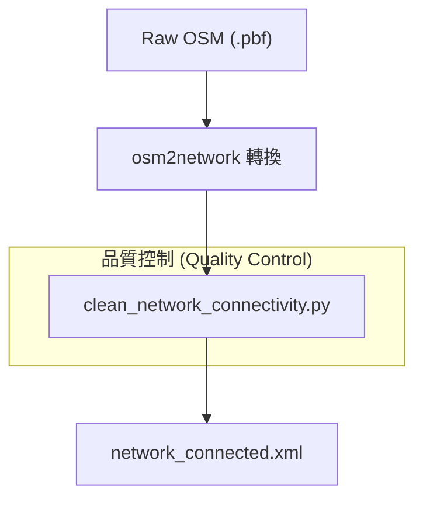

# Wiki: OpenStreetMap (OSM) Network Ingestion

OpenStreetMap (OSM) 是 MATSim 模擬中最常用的外部路網資料源。本文件以技術維基風格定義其匯入機制、映射邏輯與潛在架構風險。

---

## 1. 機制概述 (Technical Summary)

MATSim 的 OSM 匯入流程本質上是一個將「非正式標籤（Unstructured Tags）」轉換為「嚴謹交通流參數（Physical Parameters）」的啟發式過程。核心工具通常為 `Osm2NetworkReader` 或 `pt2matsim` 中的 `Osm2MultimodalNetwork`。

### 1.1 核心轉換逻辑
1.  **節點提取 (Node Extraction)**：識別所有具備地理座標的 `Secondary Nodes`，並找出 `Ways` 相交處的 `Infrastructure Nodes`。
2.  **拓撲重建 (Topology Reconstruction)**：將連續的 `Way` 依照相交節點切分為多個 `Link` 物件。
3.  **模式過濾 (Modal Filtering)**：依據 `highway` 標籤與 `access` 標籤判定該路段支持的運輸模式（如 `car`, `walk`, `bicycle`）。

---

## 2. 物理參數映射規範 (Parameter Mapping)

OSM 的 `highway` 標籤被映射至 MATSim 的 `capacity` 與 `freespeed`。

### 2.1 基準映射表 (Heuristic Mapping)

| OSM Tag | MATSim Mode | Freespeed (m/s) | Capacity (veh/h/lane) |
| :--- | :--- | :--- | :--- |
| `motorway` | car | 33.3 (120 km/h) | 2000 |
| `primary` | car, bus | 16.7 (60 km/h) | 1500 |
| `residential` | car, walk | 8.3 (30 km/h) | 600 |
| `footway` | walk | 1.1 (4 km/h) | - |

---

## 3. 工程演示：預處理工作流 (Demonstration)

為了保證路網拓撲的科學性，建議採用以下 Pipeline：



### 3.1 關鍵 Pipeline 演示
```bash
# 執行路網清理以保留最大連通分量 (Strongly Connected Component)
./mvnw exec:java \
  -Dexec.mainClass="org.matsim.project.tools.PrepareNetworkForPTMapping" \
  -Dexec.args="raw_network.xml clean_network.xml.gz"
```

---

## 4. 進階問答 (Advanced FAQ)

### Q: 關於座標系量綱 (Dimensionality) 的考量？
**A**: MATSim 的空間核心運算（如 Link 長度驗證）不具備地理座標系（Geodetic）的曲率修正能力。使用 WGS84 會造成經緯度單位（Degree）與物理量（Meter）的量綱衝突。本專案強制要求轉投影至 **EPSG:3826** 以確保計算精確度。

### Q: 標籤映射的同質化 (Homogenization) 風險？
**A**: 全域標籤映射會忽略路段的實體微觀差異（如路幅縮減、側向干擾）。對於高精度模擬，建議結合政府 Open Data 進行參數局部修正規範。

### Q: 節點簡化 (Node Simplification) 的必要性？
**A**: 過多的冗餘節點（如彎道節點）會增加內存開銷並降低 QSim 步進效率。建議在匯入時僅保留關鍵拓撲節點。
