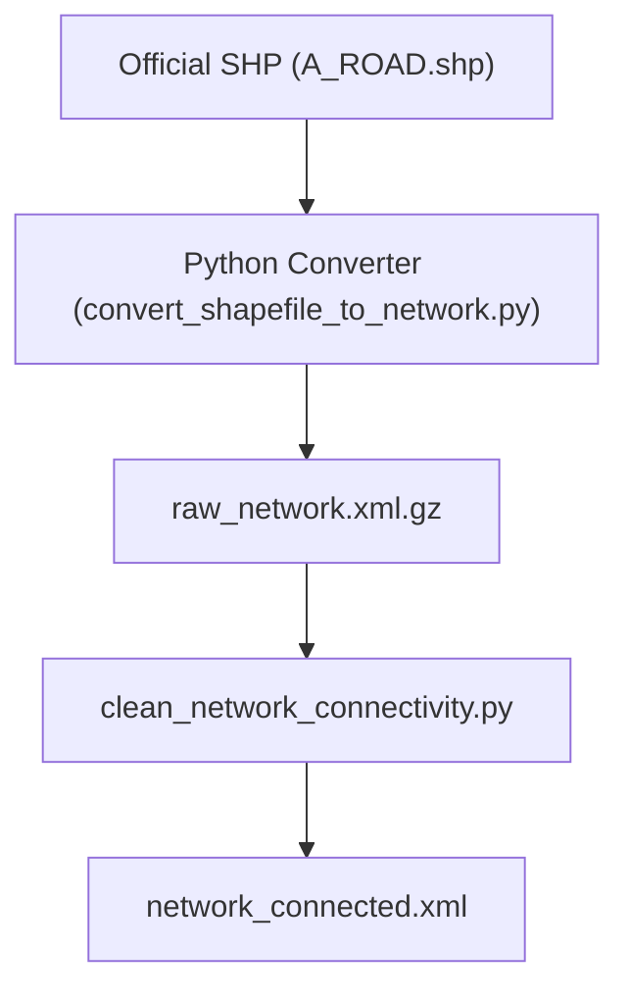

# Wiki: Shapefile (SHP) Network Integration

本文件定義將台灣官方國土測繪圖資 (Shapefile) 整合至 MATSim 路網的工程範式。相較於 OSM，SHP 提供更高精確度的官定拓撲與道路屬性。

---

## 1. 技術規範 (Technical Specification)

官方 SHP 轉換的核心在於將「幾何線段 (Geometric Lines)」轉化為「拓撲連結 (Topological Links)」。本專案使用 `convert_shapefile_to_network.py` 作為核心轉換引擎。

### 1.1 道路等級映射演示 (Road Class Mapping)
轉換引擎建立了一套基於台灣道路編碼標準的參數映射表：

```python
# 節錄自 convert_shapefile_to_network.py
ROAD_CLASS_PARAMS = {
    # Class: (freespeed_m/s, capacity_veh/h/lane, lanes, description)
    '1': (33.3, 2000, 3, '國道 National Highway'),
    '2': (25.0, 1500, 2, '省道/快速道路 Provincial Road'),
    '5': (11.1, 600, 1, '市區道路 Urban Street'),
    'default': (11.1, 600, 1, '預設 Default')
}
```

### 1.2 參數標定邏輯 (Parameter Derivation Logic)
為什麼參數要這樣設定？這並非隨機數值，而是基於以下工程邏輯：
- **Freespeed (自由流速度)**：依據《道路交通安全規則》與各級道路設計規範。例如國道標稱 120km/h 換算為 **33.3 m/s**。這是 QSim 計算代理人理想旅行時間的基石。
- **Capacity (通行能力)**：依照《台灣公路容量手冊 (TRHCM)》建議。國道單向每車道基本容量約為 2000 pcphpl。這定義了 MATSim 隊列模型 (Queue Model) 的釋放頻率。
- **Modes (運輸模式)**：SHP 的 `ROADCLASS` 決定了法律路權。國道一律標記為 `car`；市區道路則開啟 `car, walk` 等多模式屬性，以支持完整的人口活動鏈模擬。

---

---

## 2. 轉換邏輯演示 (Implementation Demo)

### 2.1 拓撲查找與節點掛載 (Topological Snapping)
當 SHP 缺少顯性的 FNODE/TNODE ID 時，系統會透過地理空間演算法自動匹配最近節點：

```python
def find_nearest_node(point: Point, node_dict: Dict[str, Tuple[float, float]], tolerance: float = 10.0):
    """
    實作幾何最近鄰搜尋，將 LineString 的端點匹配至最近的拓撲節點。
    Tolerance 設為 10m 以應對原始圖資可能的繪製間隙。
    """
    # 幾何距離判定邏輯...
    dist = ((point.x - x)**2 + (point.y - y)**2)**0.5
    if dist < min_dist:
        nearest_id = node_id
    return nearest_id
```

### 2.2 XML 序列化建立 (XML Ingestion)
將處理後的屬性封裝為 MATSim 標準 XML 結構：

```python
def create_link(parent, link_id, from_node, to_node, length, freespeed, capacity, lanes, modes):
    """
    利用 ElementTree 建立具備嚴謹物理屬性的 MATSim Link。
    """
    SubElement(parent, 'link', {
        'id': str(link_id),
        'from': str(from_node),
        'to': str(to_node),
        'length': f"{length:.2f}",
        'freespeed': f"{freespeed:.2f}",
        'capacity': f"{int(capacity)}",
        'permlanes': f"{int(lanes)}",
        'modes': modes
    })
```

### 2.3 空間匹配的必要性 (Necessity of Spatial Snapping)
為什麼還要自動匹配最近節點？即便 SHP 具備 FNODE/TNODE，自動匹配 (Spatial Snapping) 仍是確保路網穩定性的關鍵：
1.  **容錯性 (Fault Tolerance)**：GIS 繪圖時常有「極細微間隙」（如端點距離 1cm）。若純依賴 ID，會導致拓撲邏輯認定斷路，而 `find_nearest_node` 能在實體幾何層面將其強制閉合。
2.  **跨圖資整合 (Cross-Dataset Integration)**：當整合台北與新北兩份獨立 SHP 時，彼此的 FNODE ID 是完全不連動的。唯有透過 **「座標座標是唯一真理」** 的原則，才能在行政邊界處將不同來源的路網縫合起來。
3.  **模式對齊 (Mode Alignment)**：在處理 GTFS 大眾運輸站點時，這些點位通常沒有 FNODE 欄位。透過座標匹配才能將公車站精準掛載至最近的 Link 上。

---

## 3. 預處理 Pipeline (Conversion Workflow)



---

## 4. 進階問答 (Advanced FAQ)

### Q: 關於 Schema 異質性 (Schema Heterogeneity) 處理？
**A**: 當整合北北基等多縣市圖資時，首要任務是建立一套「抽象屬性映射規範」。轉換引擎必須能夠識別異質的 `ROADCLASS` 代碼並統一對齊到同一套物理引數（Speed/Cap）。

### Q: 關於存儲容量係數 (storageCapacityFactor)？
**A**: 這定點義了路段的靜態物理占用空間。在災難撤離研究中，若該參數設定不當，會導致回堵（Spill-back）傳遞與現實不符。

### Q: 自動生成拓撲的精確度風險？
**A**: 腳本雖具備 Vertex Snapping 功能，但若原始圖資間隙過大，仍會產生斷路。建議前處理容許度（Tolerance）設為 **0.01m - 0.1m**。

---

## 5. 其他提問 (Q&A)


### Q1: SHP 的 LineString 如何變成 MATSim 的 Node/Link？

**A**: 這是一個從「連續幾何」到「離散拓撲」的降維過程。

1.  **節點萃取**：從 `RDNODE.shp` 讀取所有 Point 幾何，每個 Point 的 ID 成為 MATSim Node 的 ID，座標成為 `x/y`。
2.  **路段轉譯**：從 `ROAD.shp` 讀取所有 LineString。每條 LineString 依據 `FNODE/TNODE` 欄位確立起終點。若缺少該欄位，則改以 **端點座標** 去匹配 Node。
3.  **資訊遺失**：LineString 中間的所有形狀點 (Shape Points) 會被捨棄。MATSim 的 Link 只保留「邏輯長度 (Length)」，不保留彎曲幾何。

### Q2: 為什麼 pt2matsim Mapping 是效能瓶頸？

**A**: 真正的瓶頸不在 SHP → Network 轉換，而是後續 **pt2matsim 將 GTFS 路線對齊到「截彎取直」後的路網** 這個步驟。

#### 根本原因：幾何失真 (Geometric Distortion)
MATSim 路網在轉換時會將彎曲道路簡化為「直線 Link」，但 GTFS 的站點座標仍保留在原始彎道位置。這導致：
1.  **站點離線 (Off-Link Stops)**：公車站可能落在 Link 幾何之「外」，需要搜尋最近的候選 Link。
2.  **路徑重建 (Path Reconstruction)**：每對相鄰站點之間，系統必須執行 **最短路徑搜尋 (Dijkstra/A\*)**，找出公車實際應該走的 Link 序列。

#### 計算複雜度分析
假設有：
- S 個站點 (Stops)
- 每個站點平均搜尋 C 個候選 Link (`nLinkThreshold`)
- 每對站點間執行一次最短路徑搜尋 (複雜度約 O(E log V))

總複雜度約為：**O(S * C * E log V)**

當雙北路網有 **數千條公車路線、數萬個站點** 時，這就是數小時甚至數天的運算量。

#### 為什麼要「先算好放口袋」？
pt2matsim 的設計理念是 **預先計算所有可能路徑**，將結果寫入 `transitSchedule.xml` 的 `<route>` 標籤中。這樣：
- **模擬時 (Runtime)**：公車只需讀取預存的 Link 序列，無需即時路徑搜尋。
- **若不預算**：每次模擬、每個公車班次、每個站點間都要重跑一次 Dijkstra，模擬時間會爆炸式增長。

#### 優化方向
1.  **縮小搜尋範圍**：降低 `maxLinkCandidateDistance` 與 `nLinkThreshold`。
2.  **分批處理**：先處理捷運（站點少、路徑固定），再處理公車。
3.  **空間索引**：pt2matsim 內部已使用 QuadTree，但路網過大時仍會觸及 I/O 瓶頸。

### Q3: 如何驗證產出的 network.xml 是「乾淨的」？

**A**: 品質控管透過 `clean_network_connectivity.py` 實作，核心邏輯是 **BFS 連通性分析**：

```python
# 節錄自 clean_network_connectivity.py (Line 21-54)
def find_connected_components(nodes, edges):
    # Build adjacency list (undirected)
    adj = defaultdict(set)
    for link_id, (from_node, to_node) in edges.items():
        adj[from_node].add(to_node)
        adj[to_node].add(from_node)
    # BFS from each unvisited node...
```

腳本會找出所有「連通分量 (Connected Components)」，並僅保留最大的那一個，強制移除所有孤島路網，確保任意兩點間都存在路徑。

---

## 6. 設計爭議與架構辯論 (Design Controversies Q&A)

本節探討 MATSim 路網設計中那些「看似反直覺」但有其深層理由的架構決策。

### Q1: 為什麼轉換時會「截彎取直」？為何不保留彎曲幾何？

**A**: 這是 MATSim **隊列模型 (Queue Model)** 的核心設計權衡。

#### MATSim 的抽象層級
MATSim 是 **介觀模擬器 (Mesoscopic Simulator)**，不是微觀模擬器（如 SUMO）。它不追蹤車輛在路段內的精確 XY 座標，而是將每條 Link 視為一個 **FIFO 佇列**：
- 車輛「進入」Link → 等待通過時間 → 「離開」Link。
- 通過時間 = `length / freespeed`（長度 / 自由流速度）。
- **彎道的幾何形狀對佇列邏輯毫無影響**——只有「長度」會影響時間。

#### 記憶體與效能考量
若保留每條 Link 的所有形狀點 (Shape Points)：
- 一條彎道可能有 50 個中間點，雙北路網約 10 萬條 Link。
- 這意味著儲存 **500 萬個額外座標點**，記憶體暴增，但對模擬結果沒有任何影響。

---

### Q2: 為何不能用足夠多節點來「模擬」彎道？

**A**: 這涉及 **節點爆炸 (Node Explosion)** 問題。

#### 節點在 MATSim 中的意義
在 MATSim 中，每個 Node 代表一個 **潛在的路徑決策點（交叉口）**。
- Router 計算最短路徑時，必須遍歷所有 Node。
- 節點數量直接影響 **Dijkstra/A\* 的計算複雜度**。

#### 數學推演
假設：
- 原始路網有 50,000 個「真正的」交叉口節點。
- 若為了保留彎道幾何，每條彎道新增 10 個形狀節點。
- 新節點數 = 50,000 + (100,000 Links * 平均 5 個形狀點) = **550,000 節點**。

這會導致：
1.  **路徑計算爆炸**：Dijkstra 複雜度從 O(E + V log V) 中的 V 增加 11 倍。
2.  **無意義的決策點**：這些「假節點」不是交叉口，車輛不會在此轉向，但 Router 仍須處理。

#### MATSim 的設計哲學
> **「邏輯拓撲優先於物理幾何」**

MATSim 關心的是「從 A 到 B 需要多久、會不會塞車」，而不是「車子在彎道上的精確軌跡」。

---

### Q3: 這對視覺化有什麼影響？

**A**: 這是 **模擬精度 vs. 視覺保真度** 的取捨。

- **模擬結果**：完全正確。旅行時間、擁塞程度、模式選擇都基於「長度」計算，與幾何無關。
- **視覺輸出**：在 Via 或 SimWrapper 中，路網會呈現「直線化」的樣貌，不符合實際地圖。
- **解決方案**：可在後處理階段將原始 SHP 幾何疊加到輸出影片中，僅做視覺校正。

---

### Q4: pt2matsim 的「人工連結 (Artificial Links)」是什麼？

**A**: 當站點離最近的 Link 太遠時，pt2matsim 會自動建立一條 **虛擬連結**，將站點「拉」到路網上。

#### 風險
- 這些人工連結沒有真實的物理對應，可能導致公車「穿牆」或「飛躍」河流。
- 過多人工連結代表路網與 GTFS 的空間對齊有問題。

#### 控制參數
- `maxLinkCandidateDistance`：超過此距離就會建立人工連結。
- **建議**：在 Mapping 完成後檢查 Log，統計人工連結數量。若超過 5%，應重新審視路網品質。

---

### Q5: 為何 MATSim 不支援「動態路網幾何」？

**A**: 這是 **靜態路網假設 (Static Network Assumption)** 的設計選擇。

- MATSim 的路網在模擬開始前就固定，不會在執行中改變 Link 的長度或容量（除非使用 Time-variant Network 模組）。
- 這允許 Router 在模擬前預先計算所有路徑，大幅提升效能。
- **若需動態幾何**（如施工封路），應使用 `NetworkChangeEvent` 機制，而非修改幾何本身。
