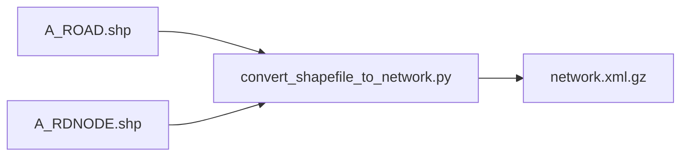
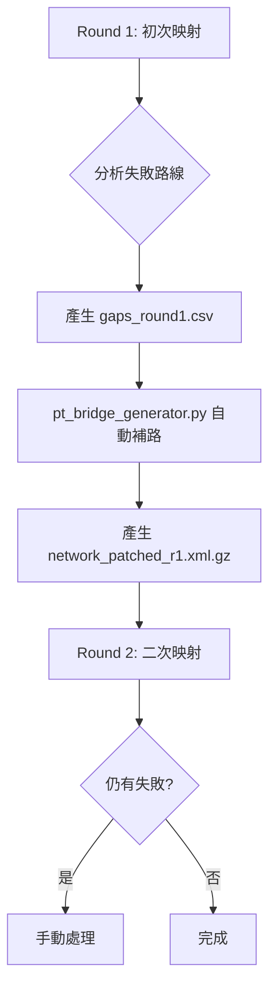

# MATSim 公共運輸 (GTFS) 全流程指南

> **文件定位**：本文件是從原始資料處理、路網映射到模擬動力學的**完整總集篇**。
> **整合來源**：
> - `NETWORK_PROCESSING_DOCUMENTATION.md` (路網準備)
> - `PT_Mapping_Workflow_Guide.md` (映射與修補)
> - `pt-dynamics-deep-dive.md` (動力學與穩定性)

---

## 第一部：路網準備 (Foundation)

在進行任何 PT Mapping 之前，必須先準備好物理路網。

### 1.1 SHP 轉 MATSim 路網
核心是將台灣常見的 GIS Shapefile (如 `A_ROAD.shp`) 轉換為 MATSim 的 `network.xml`。



**參考腳本**: `convert_taipei_network.py`

### 1.2 物理屬性定義
MATSim 路網依賴以下物理屬性來決定行車速度與容量 (Capacity)：

| 道路等級 (Class) | 名稱 | 速限 (km/h) | 容量 (veh/h) | 備註 |
|:---|:---|:---|:---|:---|
| 1 | 國道 | 120 | 2000 | 封閉式高快速道路 |
| 2 | 省道 | 90 | 1500 | |
| 3 | 縣道 | 60 | 1000 | |
| 4 | 鄉道 | 50 | 800 | |
| 5 | 市區道路 | 40 | 600 | **公車最常行駛的路段** |

> [!WARNING]
> **常見陷阱：單行道與橋樑**
> 原始 SHP 的單行道標註若有誤，或跨河橋樑 (`BRIDGE.shp`) 遺失，會導致路網產生大量「斷點」。這需要在後續步驟透過自動化工具修補。

---

## 第二部：GTFS 映射原理 (The Mapping)

### 2.1 核心概念：映射是「綁定」而非「路由」
PT Mapping 的本質是將 GTFS 的 **Stop** 與 **Route** 綁定到路網的 **Link** 上。

1.  **Stop Link**: 公車停靠上下客的路段。
2.  **Transit Link**: 公車行駛經過的路段。

#### 概念圖解
```mermaid
graph TD
    subgraph "Transit Schedule 層"
        SA[站點 A] --> SB[站點 B]
    end
    subgraph "Road Network 層"
        L1[Link 1 (Stop A)] ==> L2[Link 2] ==> L3[Link 3 (Stop B)]
    end
    SA -.-> L1
    SB -.-> L3
```

### 2.2 為什麼需要 Shapes？
標準映射僅使用 Dijkstra 找最短路徑，容易導致公車「切西瓜」。引入 `shapes.txt` 後：
- **PublicTransitMapperWithShapes**: 會將 GTFS 的軌跡點投影到路網，引導 Dijkstra 優先選擇靠近軌跡的道路。
- **工具位置**: `pt2matsim-with-shapes.jar`

---

## 第三部：迭代修補策略 (The Fixer)

當處理複雜路網（如單行道迷宮、高架橋匝道）時，映射常會失敗。我們採用「**兩輪映射 + 自動修補**」策略。

### 3.1 核心流程圖



### 3.2 技術詳解：SCC "孤島" 與 Bridge Link "救星"

#### 第一部分：白話解釋 (The Concept)
用最簡單的話來說，SCC 問題就是路網中的 **「孤島效應」** 或 **「黑洞」**。
*   **黑洞 (Sink)**：公車開進某個區域（如某個社區或單行道網），卻發現**沒有任何一條路可以開出來**回到主幹道。
*   **孤島 (Source)**：公車總站設在某個區域，但沒有路可以連通到外面的世界。

這在圖學上稱為「非強連通」。對於 MATSim 的路由演算法 (Dijkstra) 來說，這就像是走進迷宮的死巷，算到這裡就卡死了，導致整條公車路線路徑計算失敗 ("No route found")。

#### 第二部分：系統性解釋 (The Systematics)
當你在 Log 中看到 "No route found" 時，代表 MATSim 的路由演算法 (Dijkstra) 在路網圖上**找不到一條從起點 (Link 110) 到終點 (Link 200) 的連續路徑**。以下是導致 "Dijkstra 走投無路" 的三大物理主因：

| 物理原因 | 詳細情境 | Dijkstra 的視角 |
|:---|:---|:---|
| **1. 拓撲斷裂 (Topology Breaks)** | 高架橋與平面道路在幾何上重疊，但在路網 XML 中**沒有節點 (Node) 相連**。 | "我看得到下面的路 (Link 200)，但我跳不下去 (沒有 Node 連接)，前方是死路。" |
| **2. 單行道陷阱 (One-Way Trap)** | 公車開進單行道巷弄，但該區域沒有規劃迴轉道，車輛**只能進不能出** (Sink)。 | "我進了 Link 110，但所有接續的 Link 都是指回來的，我被困在這個圈圈裡了。" |
| **3. 孤島效應 (Island/Source)** | 公車總站位於一個封閉區域，出口標籤錯誤，導致**無法連通到主幹道**。 | "我在孤島 (Link 110) 上，周圍是大海，找不到橋樑連到大陸 (Link 200)。" |

#### 第三部分：我們的解決方案——自動造橋 (Bridge Mapping)
為了不讓公車卡死，我們開發了一套自動修復機制（見 `pt_bridge_generator.py`），運作原理如下：

1.  **偵測斷點**：程式先找出所有讓公車「卡住」的路段 (Umbrella Handles/Link 110)。
2.  **尋找生路**：利用 **KDTree (空間搜尋樹)** 技術，快速在半徑 200 公尺內搜尋最近的「主幹道 (Link 200)」。
3.  **搭建橋樑**：在「卡住點」與「主幹道」之間，強制建立一條虛擬的 **Bridge Link** (`type=pt_bridge`)。

**注入操作圖解：**
```mermaid
graph LR
    L110[Link 110 (卡住/黑洞)] --X 斷路 X--> L200[Link 200 (主幹道)]
    L110 -- "注入 Bridge Link (虛擬橋樑/緊急逃生梯)" --> L200
```

> [!NOTE]
> **為什麼不直接瞬移 (Teleport)？**
> 如果用瞬移，公車會從螢幕上消失再出現，這會破壞視覺化效果與乘客的旅行時間計算。使用 **Bridge Link**，公車雖然是在虛擬路段上跑 (Bridge Link 預設 40km/h)，但在模擬中仍有**速度**、會消耗**時間**，這是更符合物理模擬的做法，雖然幾何上看起來像飛過去。

---

## 第四部：模擬動力學 (Dynamics & Stability)

映射完成後，進入模擬階段，我們必須面對動態調度的挑戰。

### 4.1 轉乘懲罰 (Transfer Penalty)
SwissRailRaptor 路由器的行為高度依賴轉乘懲罰設定。

**設定位置**: `config.xml` -> `swissRailRaptor`
*   `transferPenaltyBaseCost`: 每次轉乘的固定扣分。
*   `transferPenaltyCostPerTravelTimeHour`: 轉乘等待時間的負效用。

| 設定方案 | 行為影響 | 穩定性 |
|:---|:---|:---|
| **高懲罰 (10+ min)** | Agents 為了不轉乘而硬擠直達車 (即使很慢)。 | **不穩定** (特定路線過載) |
| **低懲罰 (0-2 min)** | Agents 頻繁轉乘 (Bus A -> Bus B -> MRT)，只為快 1 分鐘。 | **穩定** (流量分散) |
| **中度懲罰 (5 min)** | **推薦設定**。平衡直達與轉乘需求。 | **最佳平衡** |

### 4.2 動態調度與震盪
若開啟動態調度 (如根據人潮動態發車)，容易產生**震盪效應 (Oscillation)**：
1.  班次 A 延誤 -> 乘客累積。
2.  班次 A 停站時間變長 -> 更延誤。
3.  班次 B 追上 A -> 兩車串連 (Bus Bunching)。

**監控指標**: `Headway Deviation`（班距標準差）。若此數值在迭代中發散，代表排班過密或路網容量不足。

---

## 第五部：輸出與驗證 (Output & Validation)

### 5.1 關鍵產出檔案
| 檔案 | 用途 | 產生階段 |
|:---|:---|:---|
| `transitSchedule_mapped.xml.gz` | **模擬用**時刻表 (含 RefId) | Mapping Round 2 |
| `network_with_pt.xml.gz` | **模擬用**路網 (含 Bridge Links) | Mapping Round 2 |
| `gaps_round1.csv` | 斷點除錯報告 | Round 1 診斷 |
| `network_gaps_visualization.geojson` | 斷點地圖視覺化 | Round 1 視覺化 |

### 5.2 驗證工具
1.  **即時監控**: `monitor_pt_mapping.sh` (監控長時間 Mapping 進程)
2.  **合理性檢查**: `CheckMappedSchedulePlausibility`
    *   檢查是否有速度異常 (>100km/h) 的公車路線。
    *   檢查 Artificial Links 的比例。

---

## 附錄：完整工具清單

| 工具名稱 | 類型 | 功能 |
|:---|:---|:---|
| `convert_shapefile_to_network.py` | Python | 路網前處理 |
| `pt2matsim-with-shapes.jar` | Java | 映射引擎 (含 Shapes 支援) |
| `diagnose_network_gaps.py` | Python | 斷點偵測 |
| `pt_bridge_generator.py` | Python | 產生 Bridge Links |
| `visualize_network_gaps.py` | Python | 視覺化 |
| `monitor_pt_mapping.sh` | Shell | 進程監控 |
