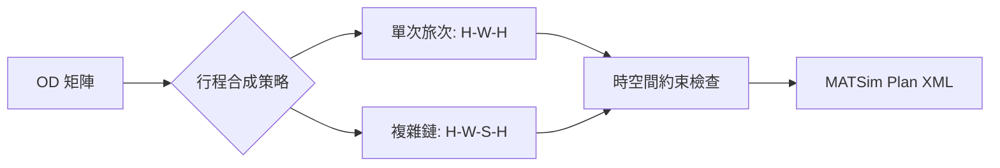

# MATSim 需求模型深究：合成人口與多行程 (Activity Chain) 建置

在大型交通模擬中，人口 (Population) 不僅是點對點的旅次，更是具備「時間-空間」連貫性的行為主體。本文件將深入探討合成人口的資料結構、多行程建置邏輯及其驗證機制。

---

## 1. 合成人口 (Synthetic Population) 的資料結構

MATSim 的 `population.xml` 採用階層式結構，核心是 `Person` -> `Plan` -> `Activity/Leg`。

### 1.1 核心物件定義
- **Person**: 具備社會經濟屬性（Age, Income, Car Ownership）的代理人。這些屬性會影響其行為偏好（如對時間的敏感度）。
- **Plan**: 一個代理人可以擁有數個計畫（Plan），但在每一次迭代中只能執行一個「被選中 (Selected)」的計畫。
- **Activity**: 行為起訖點，核心屬性包含 `type` (home, work, shop)、`x/y` (座標) 與 `end_time` (結束時間)。
- **Leg**: 兩個活動間的移動，核心屬性為 `mode` (car, pt, walk)。

> [!IMPORTANT]
> **多行程一致性原則**：一個人的行程鏈必須是閉合的（通常以 Home 為起始與終結），否則代裡人在模擬天結束後會「停留在原地」，影響次日的資源分配。

---

## 2. 多行程 (Activity Chain) 建置邏輯

當我們擁有 OD 資料（起迄點矩陣）時，必須將其轉化為連續的活動鏈。

### 2.1 從 OD 到活動鏈的轉換路徑

### 2.2 預先說明：多行程建置步驟
1.  **錨點設定 (Anchor Setting)**：首先確定代理人的主活動點（通常是 Home），設定起始座標。
2.  **鏈條連結 (Chaining)**：根據 OD 邏輯，將旅次 1 的 Destination 作為旅次 2 的 Origin。這確保了代理人在空間上的連貫性。
3.  **時間視窗校準**：
    - 活動結束時間必須嚴格遞增 (`T1_end < T2_end`)。
    - 兩活動間必須預留足夠的「旅行時間」。若活動結束時間過於緊迫，代理人在模擬中會因為「遲到」而導致負得分 (Lower Score)。
4.  **活動屬性增強**：
    - 為不同活動類型設定預設參數，例如 `office` 活動通常持續 8 小時，`grocery` 則為 1 小時。

---

## 3. 統計代表性與一致性驗證

作為研究人員，我們必須證明合成的人口能代表母體。

### 3.1 統計代表性驗證 (Statistical Representativeness)
- **空間分布驗證**：比對合成人口的活動密度圖與實際的土地利用強度感測資料（如電信信令、人口普查）。
- **屬性分布 (IPF/CO)**：檢查合成人口的收入或年齡分布是否符合邊際分布 (Marginal Distributions)。

### 3.2 活動鏈一致性驗證 (Consistency Check)
我們建議實施以下驗證邏輯：
- **幾何跳躍檢查**：若相鄰活動間的瞬時速度（距離/時間差）超過 200 km/h，則認定為無效行程。
- **孤島檢查**：確保所有 Leg 都有對應的起訖 Activity。
- **模式可達性**：例如 `car` 旅次必須確保起點與終點都具備路網連結（Link Accessibility）。

---

## 4. 架構師的實務建議

1.  **記憶體優化**：在百萬級人口模擬中，`population.xml` 的屬性標籤 (`attribute`) 越多，內存開銷越大。建議僅保留會影響 Scorer 的核心屬性。
2.  **子抽樣 (Sub-sampling)**：在開發初期，建議使用 1% 或 10% 的人口進行偵錯，並確保 `flowCapacityFactor` 隨之等比調整。
3.  **座標偏移處理**：為了避免大量 Agents 湧向同一精確座標導致的虛擬堵塞，應在 Activity 座標中加入輕微的隨機擾動 (Random Jittering)。
