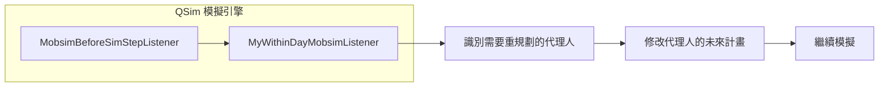
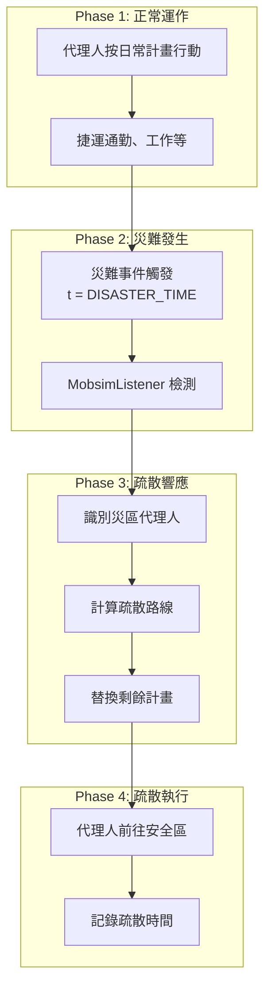

# 本專案災難撤離情境（5000_disatar）

本專案的災難模擬以「淡水沿海海嘯/洪水撤離」為核心。**不使用** MATSim 官方
`evacuation contribution` GUI，而是採用 **標準 MATSim + time-variant network**
來描述封路與疏散。SimWrapper 用於儀表板分析。

## 場景摘要

- **地點**：淡水沿海 → 文山安全區（台北都會區）
- **災害**：海嘯/洪水導致分階段道路封閉
- **規模**：5000 agents（可透過腳本擴量）
- **出發策略**：staggered 出發（例如 02:50–03:20）
- **運具**：car + pt + walk（部分 config 有 car-only）

## 大規模（28萬人）靜態情境

- **Config**：`5000_disatar/05_combined_evac/config_optimized_iter1000_280k.xml`
- **人口**：`5000_disatar/05_combined_evac/input/population_280k.xml.gz`（待生成）
- **容量係數**：flow/storage = 1.0（全量，不抽樣）
- **封路事件**：不使用 change events（靜態網路）
- **PT**：目前沿用 metro v7，公車+捷運整合完成後切換 merged schedule

## 核心檔案與目錄

- **Config**：`5000_disatar/05_combined_evac/config_*.xml`
- **人口**：`5000_disatar/05_combined_evac/input/population_5000_*.xml`
- **封路事件**：`5000_disatar/05_combined_evac/input/tsunami_changeEvents_*.xml`
- **災害資料**：`5000_disatar/evacuation_shp/`（淹水深度/海岸線）
- **路網/時刻表**：由 config 指定（例：`scenarios/...` 或 `03_phase2_production/...`）
- **工作流**：`5000_disatar/05_combined_evac/WORKFLOW.md`
- **路網建置**：`5000_disatar/00_docs/NETWORK_README.md`

## 災害封路（Time-Variant Network）

封路透過 `network.inputChangeEventsFile` 指定。常見來源：

- **深度分級**：`generate_change_events_depth.py`（依淹水深度分階段降速/封路）
- **距離分級**：`generate_change_events.py`（依海岸線距離分階段封路）
- **版本切換**：不同 config 指向不同 `tsunami_changeEvents_*.xml`

## 建置與執行（摘要）

1. **準備人口**：`5000_disatar/05_scripts/json_to_population.py` 或 `generate_evacuation_population.py`
2. **產生封路事件**：`5000_disatar/05_combined_evac/tools/generate_change_events_*.py`
3. **執行模擬**：
   ```bash
   scripts/run_simulation_with_via_export.sh \
     5000_disatar/05_combined_evac/config_optimized_iter10.xml
   ```
4. **SimWrapper 分析**：
   ```bash
   tools/run_dashboard_pipeline.sh output_optimized_iter10
   ```

## 輸出與分析

- `output_*/output_events.xml.gz`：主要分析來源
- `analysis/`：SimWrapper 需要的 CSV/YAML/AVRO
- `tools/analyze_agent_speeds.py`、`tools/generate_stuck_agents_csv.py`：慢速/卡住診斷

---

# 文件 1：Within-Day Replanning (Chapter 30)

## 第 30 章：日間重規劃 (Within-Day Replanning)

**作者：Christoph Dobler 和 Kai Nagel**

### 30.1 基本資訊

#### 30.1.1 實作方案 1

  * **文件入口：** `http://matsim.org/extensions` → `withinday`
  * **模組調用：** `http://matsim.org/javadoc`
  * **精選出版物：** 見 30.4.2 節
  * **教學範例：** `RunWithinDayExample` 類別

#### 30.1.2 實作方案 2

  * **文件入口：** `http://matsim.org/extensions` → `withinday`
  * **模組調用：** `http://matsim.org/javadoc`
  * **精選出版物：** 見 30.4.3 節
  * **教學範例：** `RunOwnMobsimAgentUsingRouter` 類別

-----

### 30.2 簡介

近年來，運輸規劃和交通管理領域對於場景中不可預見（或僅部分可預見）事件的興趣日益增加。部分可預見的事件常發生在計程車和汽車共享的情境中。例如，有搭乘計程車計畫的代理人（Agent）無法預知當他們需要時哪輛計程車可用。在使用汽車共享時，代理人可能會走到站點檢查是否有車。如果沒有，代理人可以決定等待，或是改變計畫轉用其他交通模式。而交通事故、恐怖攻擊或地震等災難則是完全不可預測事件的例子。

如前所述，傳統的模擬方法（用於預設的 MATSim）使用迭代過程計算供需均衡。在那裡，假設模擬的是一種典型情況，代理人可以依賴類似情況（如先前的迭代）的經驗。將迭代方法應用於具有意外事件的場景會導致代理人行為不合邏輯等問題，從而產生錯誤的結果。

在下一節中，我們將介紹這些問題以及一種替代的模擬方法。一方面，這種方法——稱為**日間重規劃（Within-Day Replanning）**——僅模擬單次迭代，避免了迭代模擬過程產生的問題。另一方面，這種方法需要更詳細的代理人行為模型。隨後，我們將以 MATSim 為基礎討論迭代方法，接著介紹將日間重規劃方法整合到框架中的兩種不同實作方式，並包含技術實作的討論。

-----

### 30.3 模擬方法

#### 30.3.1 迭代模擬方法

只要場景描述的是典型情況或日子，迭代式的「逐日（day-to-day）重規劃」方法是合適的。對於此類場景，假設代理人熟悉典型的事件（如尖峰時段的交通擁堵）是可行的。因此，他們會試圖避免在這些時間駕駛，或使用交通較少的替代路線。然而，如果場景包含代理人無法預見的意外事件（例如事故或惡劣天氣），使用迭代方法就不是合適的選擇。

首先，在這種情況下無法達到使用者均衡（User Equilibrium），因為代理人沒有足夠的資訊來選擇最佳路線和日常活動計畫。另一個問題是最佳化過程本身。即使代理人因為缺乏資訊而隨機選擇路線，如果嘗試足夠多不同的路線，它最終也會找到一條好路線。

圖 30.1 展示了一個簡單的範例場景，其中迭代方法會產生不合邏輯且錯誤的結果。

  * 在圖 30.1(a) 中，顯示了代理人在樣本路網中的計畫路線，包括駕駛通過路線上每個節點的時間。顯然，只有在沒有例外事件發生時，這些時間才有效。
  * 圖 30.1(b) 顯示了一條路段發生了事件（如事故），導致該路段被阻斷兩小時。
  * 結果，代理人到達目的地的時間比預期晚了兩小時（圖 30.1(c)）。
  * 當此場景進行迭代時，代理人會意識到其路線的行駛時間比預期長得多，因此會選擇另一條路線。事故造成的交通堵塞可能會增加被阻斷路段旁其他路段的行駛時間。
  * 因此，代理人可能會找到一條與原始路線截然不同的路線（圖 30.1(d)）。仔細觀察新路線首次偏離原始路線的節點，會發現這甚至發生在事故發生**之前**，這是不可行且不合邏輯的。

避免此類問題的一個顯而易見的解決方案是使用沒有迭代最佳化過程的替代模擬方法。下一節將討論這種方法及其必須滿足的要求。

> **[圖片：請參考原始文件 Page 3, Figure 30.1]**
> *圖 30.1：路網中的例外事件。 (a) 規劃路線的路網；(b) 有例外事件的路網；(c) 有例外事件和規劃路線的路網；(d) 有例外事件和適應後路線的路網。*

#### 30.3.2 日間重規劃方法

日間重規劃方法使用的策略與迭代方法截然不同。它不模擬多次迭代，而是僅模擬單次迭代。因此，代理人必須能夠在這次迭代中調整他們的計畫，而無法獲得來自先前迭代的資訊。為此，他們必須持續收集資訊，並在決定如何（反應）行動時考慮他們的慾望、信念和意圖。

迭代方法可以使用「最佳反應（best-response）」模組，而日間方法必須使用某種可稱為「最佳猜測（best-guess）」的模組。行駛時間就是一個明顯的例子。在迭代方法中，行駛時間可以從上一次迭代收集，甚至可以是對過去幾次迭代的平均。系統越接近鬆弛狀態（relaxed state），兩次迭代之間的行駛時間差異就越小。這在日間方法中是不可能的。即使代理人擁有完美的知識，它也只能假設未來的交通流量將如何演變。為此，它可以考慮不同的資訊來估算行駛時間。例如，它可以採用沒有例外事件的典型日子的行駛時間，並將其與模擬當天收集的資訊結合起來。根據這些資訊的數量和品質，代理人可能會或多或少地依賴其經驗。

因此，代理人的決策過程成為一個重要議題。在迭代方法中，每個代理人都擁有完全資訊，因此可以選擇最佳路線。由於可用資訊有限，這在日間方法中是不可能的。例如，一個代理人可能會選擇一條預期行駛時間很短但不確定性很高的路線。另一個代理人可能不願意冒這個險，因此選擇一條行駛時間較長但更可靠的路線。資訊的感知在代理人之間也可能不同；一個可能依賴媒體交通資訊，另一個可能會忽略它。

每個日間重規劃行動由兩個參數分類：**被重新規劃的計畫元素**（活動或旅次）和**執行重新規劃的時間點**（現在或未來某個時間點）。

  * 如果重新規劃一個**活動（Activity）**，可以進行多種更改：調整開始和結束時間、更改地點、取消活動，或從頭創建新活動。
  * 對於**旅次（Trip）**，可以重新規劃起點和終點、路線、交通模式和出發時間。

重新規劃單個計畫元素通常會引發連鎖反應，迫使重新規劃其他計畫元素。例如，如果取消一個活動，往返該活動的旅次必須合併。

第二個參數取決於重新規劃的計畫元素何時執行。這可以是當前正在執行的元素，也可以是將來要執行的元素。顯然，對於當前正在執行的計畫元素，並非所有上述重新規劃行動都能進行，例如，當前正在進行的活動的開始時間或旅次的交通模式無法再調整。

由於可用資訊有限，與迭代方法相比，日間重規劃方法不會收斂到使用者均衡。在模擬期間做出的決策在當時看來可能是最佳的。然而，回顧性評估時，代理人可能會意識到並非如此。

圖 30.2 顯示了如何將日間重規劃整合到 MATSim 的迭代最佳化循環中。一個額外的區塊與移動模擬建立另一個（內部）循環。根據模擬場景的類型，可以跳過外部循環。

#### 30.3.3 結合方法

除了純粹的迭代或日間重規劃方法外，另一種選擇是結合它們。一個明顯的應用是解決無法提前準確規劃的情況，如停車或汽車共享。例如，代理人可以規劃停車活動，但無法預知到達時哪些停車位可用。因此，當代理人開始選擇停車位時，可以使用日間重規劃。

-----

### 30.4 實作 (Implementation)

#### 30.4.1 一般思路

日間或途中重規劃意味著旅行者在白天或在路線上進行重新規劃。這意味著模擬需要在 mobsim（路網加載）運行時找到某種方式來影響代理人。對於 MATSim 的主要路網加載模組（稱為 QSim），這可以通過插入一個代理人循環來實現，如下所示：

```java
void doSimStep() {
    for (each agent) { // <-- 代理人循環
        agent.doSimStep();
    }
    for (each link) {
        link.doSimStep();
    }
    for (each node) {
        node.doSimStep();
    }
}
```

在這個循環中，每個代理人都有機會在每個時間步進行思考。顯然，代理人可以決定他/她沒什麼可思考的並立即返回。然而，這種方法會導致計算上的挑戰。在每個時間步遍歷所有路段和節點已經是一個昂貴的操作。而且，路段或節點的數量通常比場景中合成人的數量小一個數量級。因此，為了使上述方法在計算上有效率，必須進行大規模的最佳化。

上述方法的替代方案是**僅在需要做出決定時詢問每個代理人**。駕駛員最重要的決定是選擇下一條路段（Link），即：

```java
class MyDriverAgent implements DriverAgent {
    @Override
    public Id<Link> chooseNextLink() {
        // <決定下一條路段 ID 的演算法>
        return nextLinkId;
    }
}
```

其他可能詢問代理人的查詢也需要類似的實作，例如：

  * 旅次是否應該在當前路段結束？
  * 代理人是否應該在當前站點下車？
  * 旅次使用的車輛 ID 是什麼？

從代理人的角度來看，這種方法可能被稱為**事件驅動（event driven）**，因為代理人僅在此類事件發生時進行心智活動。MATSim 確實有一種機制來編寫此類代理人並將其插入 QSim 中（詳見 30.4.3 節）。這種方法的一個挑戰是需要重新編寫完整的代理人。這個代理人需要有足夠的能力來定位自己；例如，它需要能夠計算合理的路線。

另一方面，有些情況下實際上不需要在途中每個路口都具備決策能力。例如，對於典型的疏散應用，讓所有代理人按照正常的日常計畫開始是有意義的。當發布緊急警報時，模擬可以遍歷所有代理人並決定他們如何反應。這將通過替換當前計畫的部分或全部未來元素來完成。對於此類應用，\*\*基於計畫的方法（Plan-based approach，30.4.2 節）\*\*更為合適。這不僅在概念上比讓每個代理人為自己回答更容易，而且在計算上也更有效率，因為它僅在觸發時被調用並僅影響受影響的代理人。

總體而言，實作者和使用者必須平衡他們的需求：

  * 如果代理人需要重新規劃的時間相對較少，且這些時間很容易識別（如緊急信號），則適合使用**基於計畫的方法**。
  * 如果代理人在模擬中幾乎完全沒有計畫，像一個完全反應式的計程車司機，那麼這意味著需要**替換代理人（Replacing the Agent）**。

#### 30.4.2 實作方案 1：基於計畫的實作 (Plan-Based Implementation)

當向 MATSim 添加日間重規劃時，其迭代循環必須進行調整（如圖 30.2 所示）。實作是透過所謂的 `MobsimEngine` 實現的，它可以插入到 QSim 中。包含日間重規劃邏輯的引擎（稱為 `WithinDayEngine`）不模擬交通流，而是追蹤代理人並調整他們的計畫。這分為兩個步驟：

1.  識別在當前時間步必須調整計畫的代理人。
2.  執行計畫的調整。

圖 30.3 顯示了 `WithinDayEngine` 的結構。多個 `Replanner`（重規劃器）可以註冊到引擎中。每個 `Replanner` 代表一種獨特的重規劃策略（如重新路由或時間變異），並使用一組 `Agent Selector`（代理人選擇器）與代理人通信並選擇那些有機會調整計畫的人。

> **[圖片：請參考原始文件 Page 7, Figure 30.3]**
> *圖 30.3：WithinDayEngine 結構圖。*

職責在 `Replanner` 和 `AgentSelector` 之間劃分。前者負責調整代理人的計畫，但他們不應該檢查代理人是否應該被重新規劃。後者應選擇必須重新規劃的代理人，但不應更改他們的計畫。

MATSim 提供了一些基本的 `Replanner` 和 `AgentSelector`。此外，為了避免重複實作相同的功能，引入了所謂的 `AgentFilter`。它們的任務是從代理人集合中移除不符合過濾條件的代理人。

除了識別代理人並調整其計畫的邏輯外，另一個重要的日間重規劃框架組件是持續收集資訊並將其提供給 `AgentSelectors` 的程式碼。例如，`TravelTimeCollector`（圖 30.5）就是此類類別的一個例子。它通過收集在給定時間內經過路段的代理人的行駛時間並取平均值，向 `Replanner` 提供實際的路段行駛時間。

> **[圖片：請參考原始文件 Page 10, Figure 30.5]**
> *圖 30.5：TravelTimeCollector。*

#### 30.4.3 實作方案 2：替換代理人 (Replacing the Agent)

如前所述，MATSim 有兩個層級的代理人：

  * **Person**：是一個 Q-learning 代理人，在迭代中持續存在。
  * **MobsimAgent**：是一個反應式代理人，僅在 mobsim 期間存在。

在某些情況下，假設反應式代理人仍然遵循計畫是不合適的：例如，當代理人邊走邊制定路線時。在這種情況下，我們可以看看不再擁有預先計算計畫，而是邊走邊做決策的 `MobsimAgent`。還有一個 `DynAgent` 類別，它封裝了 `MobsimAgent`，使其更易於使用（第 23.4 節）。

**30.4.3.1 代理人介面**
`DriverAgent` 介面結構如下：

  * `Id chooseNextLinkId()`：在路口詢問代理人下一步該怎麼走。
  * `boolean isWantingToArriveOnCurrentLink()`：詢問代理人是否想在當前路段到達。
  * `void notifyMoveOverNode(Id newLinkId)`：通知代理人已通過路口並進入新路段。

**30.4.3.3 感知、決策、整合**
代理人需要感知環境。一般方法是使用事件（Events）通道。建議將觀察者（Observer）、指導（Guidance）和代理人（Agent）本身分開。

  * **Observer**：監聽事件並記憶資訊。
  * **Guidance**：根據觀察者的資訊為代理人提供建議（例如計算下一個路段 ID）。
  * **Agent**：擁有 Guidance 對象，並在 `chooseNextLinkId()` 中調用 Guidance 的方法。

-----

# 文件 2：Evacuation (Chapter 71 & Chapter 41)

## 第 71 章：漢堡 威廉堡 (Hamburg Wilhelmsburg)

**作者：Hubert Klüpfel 和 Gregor Lämmel**

### 71.1 簡要描述

本案例研究調查了漢堡威廉堡（Hamburg-Wilhelmsburg）B75 公路遷移對疏散交通的影響。威廉堡在 1962 年曾遭受嚴重洪水侵襲。B75 是主要的南北主幹道之一。本研究比較了兩種情況（如表 71.1 所示）：

1.  **B75 舊路線（B75 old）**：當前位置。
2.  **B75 新路線（B75 new）**：位於現有鐵軌旁的新位置（圖 71.1）。

> **[圖片：請參考原始文件 Page 2, Figure 71.1]**
> *圖 71.1：B75 公路的當前路徑（圖中）與位於鐵路旁的新路徑（東側）。*

### 71.2 路網

MATSim 路網是從 OpenStreetMap (OSM) 文件生成的。幸運的是，OSM 文件已包含標記為 "open 2016" 的新 B75 公路軌跡。因此，"B75 old" 和 "B75 new" 兩個變體的路網可以從同一個 OSM 文件導出。在疏散中，一些道路會被封鎖以避免交叉和入城交通（圖 71.3）。

### 71.3 疏散場景

比較基於總體疏散時間、不同單元（Cell）的清除時間以及道路路網的使用率。

**71.3.1 出發時間分佈**
出發時間分佈在 `scenario.xml` 文件中指定。選擇了均值（mu）和標準差（sigma）為 30 分鐘（1800秒）的常態分佈，範圍為 0 到 1 小時。這反映了疏散程序的假設：

  * 總時間框架：最少 7 小時。
  * 準備階段：預計 3 小時。
  * 疏散可用時間：3 小時（含 1 小時緩衝）。
  * 模擬參考點設為 t=3 小時。
  * 成功疏散的標準是 ASET（可用安全疏散時間，3小時）\> RSET（所需安全逃生時間）。

**71.3.2 人口規模**
人口數據存儲在 Shape file 中。在本模擬中，假設所有在威廉堡註冊的汽車都會離開該區域，這是一個導致交通負荷繁重的「最壞情況」假設。

### 71.4 模擬結果

模擬結果總結於表 71.2。

  * 第 0 次迭代基於最短距離，導致了不合邏輯的行為（所有代理人都湧向最近的出口，導致人為擁堵）。
  * 從第 10 次迭代開始，時間收斂到實際值（約 1小時 40-50 分鐘）。

結論：B75 公路的遷移對整體疏散時間沒有重大影響。約兩小時的疏散時間在可用安全逃生時間（ASET）範圍內。

> **[圖片：請參考原始文件 Page 7, Figure 71.7]**
> *圖 71.7：B75 舊軌跡與新軌跡的路網利用率比較。*

-----

## 第 41 章：疏散規劃：整合式方法 (Evacuation Planning: An Integrated Approach)

**作者：Gregor Lämmel, Christoph Dobler 和 Hubert Klüpfel**

### 41.1 基本資訊

  * **文件入口：** `http://matsim.org/extensions` → `evacuation`
  * **模組調用：** `http://matsim.org/javadoc` → `evacuation` → `RunEvacuationExample` 類別
  * **精選出版物：** Lämmel (2011); Lämmel et al. (2009)

本章介紹了一種使用 MATSim 疏散貢獻模組（evacuation contribution）執行疏散模擬的整合方法。該方法包含執行疏散分析的所有工作流步驟：選擇疏散區域、定義人口、指定行為參數（如預移動時間分佈和疏散模式——汽車或行人）以及分析模擬輸出。所有這些步驟都可以在一個圖形使用者介面（GUI）中執行。

### 41.2 相關工作

疏散過程的模擬近年來備受關注。Lämmel (2011) 討論了作為 MATSim 貢獻模組的此類模型。基本上，此模型實作了與「常規」運輸場景相同的迭代學習方法。Dobler (2013) 提出了另一種 MATSim 疏散模擬工作（見第 30 章），其主要區別在於允許代理人使用日間重規劃框架自發調整計畫。

### 41.3 下載 MATSim 和 Evacuation

1.  從 MATSim 官網下載 nightly build 和 evacuation 擴充包。
2.  解壓縮並將 evacuation 的 jar 檔和 libs 資料夾移動到 MATSim 核心 jar 檔所在目錄。
3.  使用命令行啟動 ScenarioManager：
    `java -cp evacuation-0.6.0-SNAPSHOT.jar;MATSim_rxxxxx.jar org.matsim.contrib.evacuation.scenariomanager.ScenarioManager`

### 41.4 十五分鐘導覽 (The Fifteen-Minute Tour)

1.  **OSM**：下載一個小的 OSM 區域文件（如 500m x 500m）。
2.  **ScenarioManager**：啟動並創建新場景。指定 OSM 文件路徑和輸出目錄。
3.  **Sample Size**：將樣本大小設為 0.1。
4.  **Departure**：設定出發時間分佈（如常態分佈，mu/sigma 為 600 秒）。
5.  **Area**：在 Area 標籤頁中，透過滑鼠定義圓形疏散區域。
6.  **Population**：在 Population 標籤頁中定義人口。
7.  **Convert**：轉換場景為 MATSim 輸入文件。
8.  **Run**：切換到模擬標籤頁（"M" 圖示）並執行。
9.  **Analyze**：模擬結束後，切換到最後一個標籤頁進行分析。

### 41.6 場景管理器 (Scenario Manager)

**41.6.1 場景配置**
疏散場景由以下參數指定（如圖 41.1）：

  * 路網文件路徑（OSM）。
  * 主要交通類型（車輛 VEHICULAR 或 行人 PEDESTRIAN）。
  * 疏散區域文件（ESRI Shape file，可由 GUI 生成）。
  * 人口文件（ESRI Shape file，含人數屬性）。
  * 輸出目錄。
  * 樣本大小（Sample size）。
  * 出發時間分佈（Dirac-delta, Normal, Log-normal）。

> **[圖片：請參考原始文件 Page 12, Figure 41.1]**
> *圖 41.1：ScenarioManager 中的場景配置截圖與 XML 文件。*

**41.6.2 疏散區域**
使用者可以在地圖上繪製簡單的多邊形或圓形來定義疏散區域。為了計算路線，系統會將所有離開疏散區域的出口路段連接到一個「超級節點（super-node）」，從而將多目的地問題簡化為多源單目的地問題。

**41.6.3 疏散需求**
人口分佈定義類似於疏散區域，使用者繪製圓形並定義每個圓形內的人口數量。系統會隨機分配代理人在圓形區域內的座標。

**41.6.4 道路封閉**
在真實情況中，某些道路可能因災害或管理需求而封閉。ScenarioManager 提供了一個工具來創建時間依賴性的道路封閉（Road Closures），如圖 41.3(a) 所示。

**41.6.5 公車站編輯器**
對於依賴公共交通的人，ScenarioManager 允許定義公車站和時刻表（圖 41.3(b)）。限制包括：每輛公車僅服務一個站點，且總是走最短路徑。

> **[圖片：請參考原始文件 Page 17, Figure 41.3]**
> *圖 41.3：上圖：道路封閉編輯器；下圖：公車站位置與時刻表編輯器。*

**41.6.7 分析**
分析模組提供多種評估方法（圖 41.4）：

  * **累積到達曲線（Cumulative arrival curve）**：顯示隨時間推移已疏散的人數。
  * **基於 GIS 的疏散時間分析**：在網格上顯示每個單元的平均疏散時間。
  * **基於 GIS 的清除時間（Clearance time）分析**：顯示最後一個疏散者離開該單元的時間。
  * **路段利用率分析**：幫助識別主要疏散路線。

---

# 文件 3：Within-Day 程式碼模組實作指南

## 程式碼範例來源

**GitHub 倉庫**: [matsim-org/matsim-code-examples](https://github.com/matsim-org/matsim-code-examples/tree/2a40dd20336c55a0c8ca4c582d5d9489a4ff8d0c/src/main/java/org/matsim/codeexamples/withinday)

MATSim 提供兩種日間重規劃實作方式，對應不同的應用場景：

---

## 方式一：基於計畫的重規劃 (Plan-Based)

**適用場景**：疏散模擬、災難事件響應

**套件位置**：`org.matsim.codeexamples.withinday.withinDayReplanningFromPlans`

### 核心類別

| 類別 | 功能說明 |
|-----|---------|
| `RunWithinDayReplanningFromPlansExample` | 主程式入口，展示如何配置 within-day replanning |
| `MyWithinDayMobsimListener` | MobsimListener 實作，負責在模擬期間修改車輛駕駛員的計畫 |

### 實作架構



### 關鍵程式碼模式

```java
public class MyWithinDayMobsimListener implements MobsimBeforeSimStepListener {
    
    @Override
    public void notifyMobsimBeforeSimStep(MobsimBeforeSimStepEvent event) {
        double now = event.getSimulationTime();
        
        // 在特定時間觸發重規劃（如：災難警報時間）
        if (now == DISASTER_ALERT_TIME) {
            for (MobsimAgent agent : mobsim.getAgents()) {
                // 識別災區內的代理人
                if (isInDisasterZone(agent)) {
                    // 修改計畫：插入疏散腿程
                    replaceRemainingPlanWithEvacuation(agent);
                }
            }
        }
    }
    
    private void replaceRemainingPlanWithEvacuation(MobsimAgent agent) {
        // 1. 取得代理人當前位置
        // 2. 計算到安全區的最短路徑
        // 3. 替換剩餘計畫
    }
}
```

---

## 方式二：代理人替換 (Agent Replacement)

**適用場景**：計程車、共乘服務、完全反應式代理人

**套件位置**：`org.matsim.codeexamples.withinday.withinDayReplanningAgents`

### 核心類別

| 類別 | 功能說明 |
|-----|---------|
| `RunWithinDayReplanningAgentExample` | 主程式入口，展示如何創建自訂 MobsimAgent |

### 實作架構

```java
public class MyDynAgent implements DriverAgent {
    
    @Override
    public Id<Link> chooseNextLinkId() {
        // 在每個路口動態決定下一條路段
        // 可考慮即時交通資訊
        return calculateBestNextLink();
    }
    
    @Override
    public boolean isWantingToArriveOnCurrentLink() {
        // 動態決定是否在當前路段停止
        return hasReachedSafeZone();
    }
}
```

---

## 災難模擬整合方案

### 推薦架構：基於計畫的疏散重規劃

結合現有 Taipei Metro 場景，以下是整合 within-day replanning 的建議：



### 實作步驟

1. **建立 WithinDayModule**

```java
public class EvacuationWithinDayModule extends AbstractModule {
    @Override
    public void install() {
        addMobsimListenerBinding().to(DisasterAlertListener.class);
    }
}
```

2. **實作災難警報監聽器**

```java
public class DisasterAlertListener implements MobsimBeforeSimStepListener {
    
    private final double disasterTime = 8 * 3600; // 08:00:00
    private final Geometry disasterZone;          // 災難區域多邊形
    private boolean disasterTriggered = false;
    
    @Override
    public void notifyMobsimBeforeSimStep(MobsimBeforeSimStepEvent event) {
        if (!disasterTriggered && event.getSimulationTime() >= disasterTime) {
            triggerEvacuation(event.getQueueSimulation());
            disasterTriggered = true;
        }
    }
}
```

3. **疏散路徑計算**

```java
// 使用 TripRouter 計算到安全區的路線
TripRouter tripRouter = injector.getInstance(TripRouter.class);
Facility safeZoneFacility = new LinkWrapperFacility(safeLink);

List<? extends PlanElement> evacuationTrip = tripRouter.calcRoute(
    TransportMode.car,              // 或 walk, pt
    currentLocation,
    safeZoneFacility,
    now,
    person
);
```

---

## 與現有專案整合

### 需要新增的依賴

在 `pom.xml` 中確認包含 within-day 相關依賴（通常已內建於 MATSim core）：

```xml
<dependency>
    <groupId>org.matsim</groupId>
    <artifactId>matsim</artifactId>
    <version>2025.0</version>
</dependency>
```

### 建議的目錄結構

```
src/main/java/org/matsim/project/
├── RunMatsim.java                    # 現有入口
├── RunMatsimApplication.java         # 現有 CLI
└── evacuation/                       # 新增
    ├── RunEvacuationSimulation.java
    ├── DisasterAlertListener.java
    ├── EvacuationPlanModifier.java
    └── SafeZoneManager.java
```

---

## 參考資源

- [matsim-code-examples/withinday](https://github.com/matsim-org/matsim-code-examples/tree/2a40dd20336c55a0c8ca4c582d5d9489a4ff8d0c/src/main/java/org/matsim/codeexamples/withinday)
- [MATSim Book Chapter 30: Within-Day Replanning](http://matsim.org/extensions)
- [evacuation-gui Project](https://github.com/matsim-org/evacuation-gui)
